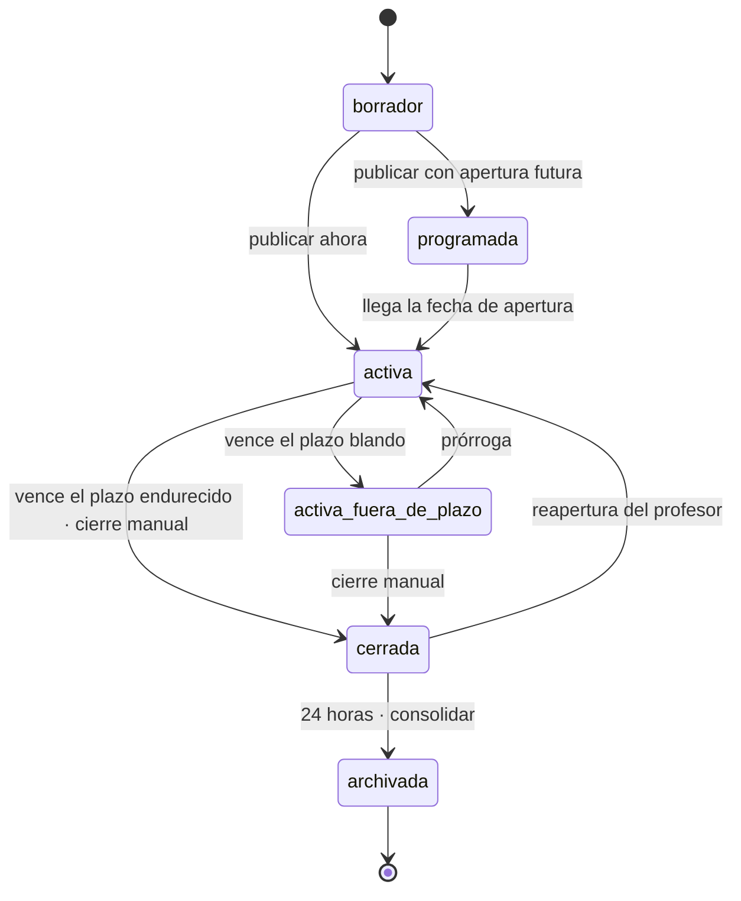
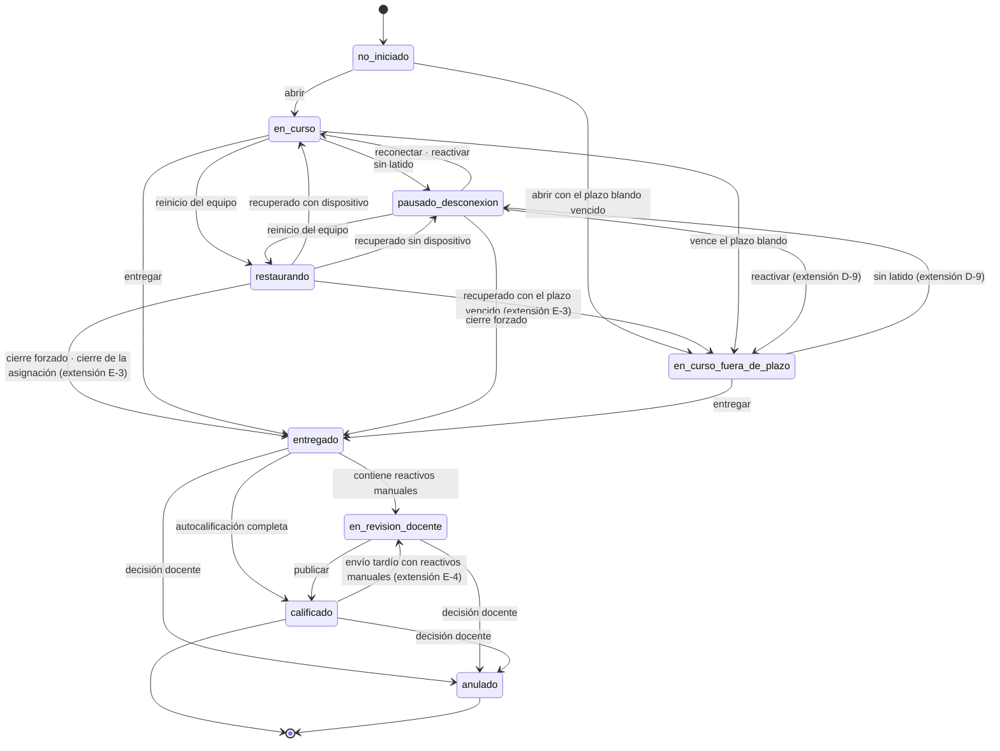

# 06 · Evaluation & Delivery Engine (MOD-010) · Modelado de datos

| Campo | Valor |
|---|---|
| Módulo | `evaluacion` · **MOD-010 · Evaluation & Delivery Engine** del Documento Maestro (DOM-006 · Evaluación y Calificación). 9 capacidades (CAP-059…067), 16 funciones (FUN-103…118), 18 reglas e invariantes, 16 eventos, 11 permisos `assessment.*`, 23 escenarios de prueba. |
| Estado | **Contrato de diseño** (2026-09-30). Lo implementan `backend/evaluacion/` (Django/DRF), `src/Avacom.Lms.Core/Evaluacion/` (cliente y reglas de bloqueo), `src/Avacom.Lms.Student/Evaluacion/` (antesala, examen, kiosco) y `src/Avacom.Lms.Ops/Pages/Examen*.cs` (aplicar y vigilar). Lo construido y cómo se comprobó está al final (§14). |
| Prefijo de tablas | `m10_` (CV-01) · 5 tablas |
| Plataforma | Python 3.12 · Django 5.2.3 · DRF 3.16.1 · SQLite · .NET MAUI (OPS en Windows; Student en Windows y Android) |
| Requisitos de partida | La sección MOD-010 del Documento Maestro (propósito, frontera, capacidades, funciones, reglas, eventos, permisos y escenarios), el guion «Ejecutar un examen crítico» (JRN-010, PAN-060…062 y PAN-120…123) y la guía de bloqueo [kiosk.md](kiosk.md). El archivo `introduccion.md` de esta carpeta llegó vacío; su contenido se reconstruyó desde el Maestro (ver ese archivo). |
| Dueño único | MOD-010 escribe sólo `m10_*`. Lee personas y grupos de `acceso`, tabletas de `device_manager` y el examen de AVACOM Biblioteca, siempre por la interfaz de su dueño. |
| Documentos hermanos | [backend.md](backend.md) (rutas, casos de uso y pruebas) · [frontend.md](frontend.md) (OPS, Student, kiosco y scripts) · [kiosk.md](kiosk.md) (cómo se bloquea una tableta) |

---

## 0 · Resumen ejecutivo

El examen es el momento en que el producto tiene que ser **creíble sin ser policial**. Este módulo no promete un sistema infalible: promete que cada respuesta queda a salvo, que el reloj es el del nodo, que lo que la plataforma no garantiza se dice en voz alta y que **anular un intento es siempre una decisión humana, motivada y con nombre**.

1. **El expediente del examen es lo único que se guarda.** El examen (sus preguntas, sus claves, su rúbrica) vive en AVACOM Biblioteca (artículo 14). Aquí hay referencias (`curso_ref`, `objeto_ref`, `pregunta_ref`), la versión congelada del curso y lo que el alumno hizo.
2. **Cinco tablas.** `m10_asignacion` (ENT-011), `m10_admision` (BR-075/076), `m10_intento_formal` (ENT-012, el agregado más crítico), `m10_incidente` (expediente de integridad, sólo inserción) y `m10_evento_salida` (outbox `evaluacion.*.v1`). Las respuestas por pregunta viven **dentro del intento** (acuerdo del CTO, 2026-09-24); no hay `m10_respuesta`.
3. **Nueve estados del intento y seis de la asignación**, exactamente los del Maestro, con una sola extensión justificada (§5.2). **Ninguna flecha hacia `anulado` parte del sistema** (INV-018): lo impone el dominio y una restricción `CHECK` de la base.
4. **Un reloj, el del nodo.** El cronómetro se congela cuando el alumno deja de dar señal y se reanuda desde el valor congelado (nunca desde el reloj de la tableta, INV-017). La reactivación de un intento suspendido es **del profesor** (PAN-061), salvo que la asignación diga `automatica`.
5. **Idempotencia total.** Una respuesta es única por (intento, pregunta, sesión, secuencia) (INV-013): reenviar el mismo paquete no duplica nada y se acusa recibo igual; entre sesiones distintas gana la más reciente (BR-138). Un intento es único por (asignación, alumno, número) (INV-012).
6. **Tres niveles de control y una sola fuente de verdad para bloquear.** `controlado`, `supervisado`, `abierto`. La tableta **declara su capacidad** (MOD-009); si no alcanza el nivel exigido el intento **no se abre solo** y espera la decisión del profesor (BR-075, BR-076). El nodo entrega a la tableta un **plan de bloqueo** (qué capas aplicar: sistema, aplicación, registro, capturas) y la tableta lo ejecuta con el kiosco de [kiosk.md](kiosk.md); el nodo nunca asume que se aplicó: la tableta lo **informa**.
7. **Los incidentes se registran, no castigan** (BR-077). `m10_incidente` es de sólo inserción, idempotente por `ref_cliente` y no cambia jamás el estado del intento. MOD-019 sella cada incidente y cada reactivación.
8. **Plazos con dos políticas.** `blando` (por defecto): al vencer, se sigue recibiendo y se marca `fuera_de_plazo`. `endurecido`: la asignación cierra al vencer, lo capturado antes y recibido dentro de la gracia (15 min) se acepta, lo demás **queda pendiente de decisión del profesor y nunca se descarta en silencio** (BR-074).
9. **La clave sólo vive en la biblioteca.** Al entregar, una sola llamada por lote (`/v2/evaluate/batch`) califica los reactivos objetivos en la escala interna de 0 a 100; los abiertos quedan `en_revision_docente`. Sin biblioteca el intento se entrega igual y se califica después.
10. **Lo que no se construye aquí, y por qué:** crear evaluaciones y añadir reactivos (FUN-103/104) se trasladó a la biblioteca; la nota final publicada y los ajustes son de MOD-011; los archivos de dibujo y proyecto, de MOD-014; SCORM (CAP-067) es V1.

---

## 1 · Requisitos que gobiernan el modelo

Se numeran 010-NN como las tablas de requisitos de los módulos anteriores. «Hoy» es el estado del repositorio **antes** de este módulo.

| # | Requisito (Maestro) | Hoy | Dónde se cumple |
|---|---|---|---|
| 010-01 | Asignar una evaluación a un grupo o a alumnos con política de plazo (FUN-108, FUN-106, FUN-107, BR-073, BR-074) | El examen se pinta atenuado «lo aplica MOD-010» (`fuera_de_alcance`) y MOD-008 tiene asignaciones de **lecciones** provisionales | `m10_asignacion` (§4.1), §8 |
| 010-02 | Nivel mínimo de modo examen y su degradación (FUN-105, FUN-118, DEC-009) | No existe | `m10_asignacion.nivel_declarado / nivel_examen`, §6 |
| 010-03 | Comparar el nivel con la capacidad declarada del dispositivo; admisión por el profesor (CAP-063, CAP-064, FUN-116, BR-075, BR-076, TST-041) | `m09_dispositivo` no declara capacidad | `m09_dispositivo.capacidad_control` (nuevo), `m10_admision` (§4.2), §6 |
| 010-04 | Abrir un intento con cupo y versión congelada (FUN-109, BR-072, INV-012, INV-024) | `m07_intento` sólo cuelga de una actividad lanzada en clase | `m10_intento_formal` (§4.3), §7 |
| 010-05 | Guardar cada respuesta con secuencia y deduplicar (FUN-110, FUN-111, CAP-065, BR-009, BR-071, INV-013, BR-138) | Existe `fusionar_respuestas` en el aula | `m10_intento_formal.respuestas` + `dominio/respuestas.py`, §4.6 |
| 010-06 | Autocalificar los reactivos objetivos al instante y dejar en cola los de revisión docente (FUN-112, FUN-113, CAP-060, CAP-062, BR-068, BR-069, NFR-012 ≤ 2 s) | `POST /api/aula/.../evaluar/` califica sin guardar | `m10_intento_formal` (`puntaje`, `requiere_revision`), §4.3 |
| 010-07 | Entregar, cerrar y marcar fuera de plazo (FUN-114, FUN-115) | — | §5, §8 |
| 010-08 | Registrar incidentes sin invalidar (FUN-117, CAP-066, BR-077, INV-018) | No existe | `m10_incidente` (§4.4) |
| 010-09 | Reloj del nodo, punto de recuperación de 5 s, reconexión en 30 s, suspensión y reactivación (INV-010, TST-015, TST-034, TST-036, PAN-061, PAN-122) | El aula congela el cronómetro de una actividad cuando la clase se suspende | `consumido_ms`, `reloj_desde`, `pausas`, §5.2 |
| 010-10 | Bloquear la tableta durante el examen en nivel Controlado (JRN-010, DEC-009) | No hay kiosco en Student | §6 y [kiosk.md](kiosk.md) |
| 010-11 | Permisos `assessment.*` (11) | No existen | §10, migración de `acceso` |
| 010-12 | Eventos `evaluacion.*.v1` (16) y auditoría (MOD-019) | El catálogo de auditoría ya reserva `evaluacion.iniciada/enviada/anulada` | §10 |
| 010-13 | Crear evaluaciones y añadir reactivos (FUN-103, FUN-104, CAP-059) | — | **Trasladado a la biblioteca** (artículo 14, D-2) |
| 010-14 | Los diez tipos de actividad (CAP-059) | La biblioteca publica seis tipos de pregunta | D-3 y Q-79 |

---

## 2 · Decisiones (y por qué)

El Maestro, el modelo del CTO y el código existente no dicen siempre lo mismo. Estas son las lecturas que se tomaron; ninguna se guardó en silencio.

| # | Decisión | Por qué / alternativa |
|---|---|---|
| D-1 | **MOD-010 es el dueño único de `m10_*`** y escribe sólo ahí. Lee identidad (`acceso`), dispositivos (`device_manager`) y contenido (biblioteca) por la interfaz de su dueño; **nunca** escribe `m01_*`, `m07_*`, `m08_*` ni `m09_*` (BR-003, BR-004). | Sección K del Maestro: «Ningún otro módulo escribe en ellos». Una tableta que cambia de capacidad la declara a `m09`; MOD-010 sólo la lee. |
| D-2 | **El examen no se crea aquí** (artículo 14). Crear una evaluación y añadir un reactivo (FUN-103, FUN-104, eventos `evaluacion.creada.v1` y `evaluacion.reactivo.anadido.v1`) ocurren **en AVACOM Biblioteca**. Las rutas de escritura correspondientes responden **409 `administracion_no_permitida`** nombrando a la biblioteca. | Constitución 14.1 y 14.2: no existe tabla de actividad, pregunta ni opción. Dos eventos del Maestro quedan sin publicar aquí, a propósito (§10). |
| D-3 | **Qué se asigna.** Un objeto `exam` de un curso instalado, con su versión. La biblioteca (contrato v2) publica seis tipos de pregunta (`multiple_choice`, `true_false`, `fill_blanks`, `matching`, `ordering`, `open`) frente a los diez del Maestro: los cinco primeros son autocalificables y `open` (texto, dibujo, audio) pasa a revisión docente. La columna `tipo` admite `examen` y `actividad`, pero la API **sólo acepta `examen`** (la actividad en clase sigue en `m07_intento` y la de estudio en `m08_practica`, Q-76). | El Maestro habla de siete tipos objetivos y tres de revisión; los que la biblioteca aún no publica (arrastrar y soltar, matemática con equivalencias, entrega de proyecto) no se inventan (Q-79). |
| D-4 | **Lo provisional no se migra.** `m07_intento` (actividades lanzadas en clase) y `m08_asignacion`/`m08_practica` (estudio) **se quedan donde están** con sus pruebas. MOD-010 nace para la **evaluación formal**; la unificación bajo `m10_*` es la pregunta Q-75. | Mover tablas con datos y 400+ pruebas verdes por una deuda declarada es un riesgo sin beneficio para este módulo. Sí se conecta el puerto `Evaluacion` del aula para que cerrar una clase cuente los intentos abiertos de MOD-010 (§11). |
| D-5 | **Cada alumno recibe su examen armado por el nodo.** `fixed`: todas las preguntas del banco. `random_balanced`: `questionCount` preguntas con dificultad y tiempo totales parecidos (tolerancias del examen) y los mismos temas, **de forma determinista** a partir de una `semilla` (`asignación‖alumno‖número`). Se guarda **sólo la lista ordenada de `pregunta_ref`** (referencias, art. 14), la semilla y la versión del curso (INV-024); el texto se vuelve a pedir a la biblioteca con la misma semilla en cada lectura. | La API de la biblioteca ya entrega `pool` (metadatos) y `questions?ids&seed` (texto sin claves) «para armar el examen de cada alumno». Determinista = reproducible en una auditoría y a prueba de reinicios. |
| D-6 | **Las respuestas viven dentro del intento** (`m10_intento_formal.respuestas`, JSON, una por elemento): decisión del CTO del 2026-09-24. INV-013 (`intento + pregunta + sesión + secuencia`) **no puede ser una restricción de la base** sobre una lista JSON; se valida en la aplicación, **dentro de la transacción**, y se prueba con reenvíos (TST-040). | Es la misma deuda que reconocen `m07_intento` y `m08_practica`. |
| D-7 | **Secuencia y sesiones.** La secuencia es un contador monotónico por intento y **sesión de alumno** que la tableta persiste **antes** de enviar (BR-009). Entre dos sesiones distintas del mismo alumno prevalece la **más reciente** (BR-138, TST-027): `sesion_orden` es el instante de apertura de la sesión (`m09_dim_sesion_alumno.iniciada_en`). Lo que llega de una sesión superada **se conserva en el intento** pero no pisa la respuesta de la sesión vigente. | Cambiar de equipo a mitad de intento (TST-026) continúa en la pregunta donde iba y no pierde nada. |
| D-8 | **El reloj es del nodo.** `consumido_ms` acumula el tiempo en que el reloj corrió; `reloj_desde` marca el inicio del tramo en marcha (nulo si está congelado). Cuando el alumno deja de dar señal más de `AVACOM_EVAL_LATIDO_VENCIDO_MS` (30 s, INV-010), el nodo congela el reloj **en el último latido** (en favor del alumno). La tableta puede informar `transcurrido_ms` (su cronómetro monotónico): el nodo toma el **mayor** de los dos valores acotado por el tiempo real, de modo que desconectarse no regala tiempo. | BR-062 / INV-017: ninguna marca temporal con valor académico sale del reloj del dispositivo. TST-032: el cronómetro cierra a los 15 minutos exactos según el reloj del nodo. |
| D-9 | **Los nueve estados del intento son los del Maestro**, con **una extensión**: `en_curso_fuera_de_plazo ↔ pausado_desconexion`. El diagrama del Maestro sólo permite pausar desde `en_curso`; un alumno puede desconectarse después de vencido un plazo blando, y sin esta flecha el intento quedaría en un estado que ya no describe la realidad. Al pausar se guarda el estado previo (`pausas[-1].estado_previo`) y la reactivación vuelve a él. | Pregunta Q-78 para el CTO. |
| D-10 | **Ninguna flecha hacia `anulado` parte del sistema** (INV-018). `anulado` exige `anulado_por` (una persona, jamás `sistema`), `motivo_anulacion` y `anulado_en`: lo comprueban el dominio y un `CHECK` en la base. Sólo se anula desde `entregado`, `en_revision_docente` o `calificado` (el diagrama no tiene `en_curso → anulado`: primero se entrega, con «cierre forzado» si hace falta). | La regla más importante del módulo (sección A del Maestro). |
| D-11 | **Capacidad y nivel.** La tableta declara su capacidad de control (`abierto` · `supervisado` · `controlado`) con el registro o el latido; el nodo la guarda en `m09_dispositivo.capacidad_control`. `controlado` significa «la capa del sistema operativo está aprovisionada» (Device Owner en Android; Assigned Access o Shell Launcher en Windows, [kiosk.md](kiosk.md) §5.1): **la app mide e informa, no presume**. Una tableta sin declarar cuenta como `abierto`. | BR-075: el nodo compara el nivel con la capacidad **declarada** antes de abrir el intento. DEC-009: «el producto no promete lo que la plataforma no garantiza». |
| D-12 | **El plan de bloqueo lo decide el nodo** (función pura `dominio/bloqueo.plan_de_bloqueo`) y viaja con el intento: qué capas aplicar (`capa_sistema`, `capa_app`), si registrar salidas y consultas, si bloquear capturas y cubrir pantallas extra. La tableta lo ejecuta con el servicio de kiosco y **informa el resultado** (`aplicado` · `parcial` · `fallido` + motivo, [kiosk.md](kiosk.md) §5.2); un bloqueo parcial o fallido es un incidente de severidad `atencion`/`alta`, **no** invalida el intento. | Una sola fuente de verdad: el cliente no tiene una tabla propia de «qué se bloquea en cada nivel». |
| D-13 | **Los incidentes son una tabla, no un evento del alumno.** El modelo v2 del CTO los representa como filas de `evento` con claves `atencion.*`/`evaluacion.*`; esa tabla no existe en el código y el Maestro nombra `Incidente` como entidad de MOD-010. `m10_incidente` es de sólo inserción, idempotente (`UNIQUE(intento, ref_cliente)`) y cada incidente deja además un asiento en la bitácora encadenada (MOD-019). | El reenvío de una cola local no debe duplicar incidentes (INV-005). |
| D-14 | **Plazos.** `blando` por defecto (DEC-014). `endurecido`: al vencer, la asignación **cierra**; los intentos abiertos se **entregan automáticamente** con lo respondido (`origen_entrega = plazo`, TST-033). Lo **capturado antes** del cierre y **recibido** dentro de la gracia (15 min, DEC-019) se acepta; lo capturado antes pero recibido después queda en `respuestas_pendientes` con `envio_tardio = pendiente_decision` y decide el profesor (BR-074, TST-042); lo capturado después se rechaza. | Se reutiliza el criterio de `classroom_engine.dominio.actividad.politica_de_recepcion`. |
| D-15 | **Las transiciones por tiempo son perezosas y además programadas.** Cada caso de uso aplica antes de leer las transiciones que el reloj ya provocó (idempotentes) y un programador del nodo (cada 5 s) las persiste aunque nadie pregunte. Al arrancar el nodo, todo intento abierto pasa a `restaurando` con el reloj congelado (BR-051, INV-010). | La corrección no depende de que el hilo del programador esté vivo (en pruebas no lo está). |
| D-16 | **Autocalificar al entregar** (FUN-112): una llamada por lote a `/v2/evaluate/batch` con la `version` del intento (nunca otra). Escala interna 0–100 (DEC-003, `porcentaje`). Los reactivos que la biblioteca marca `requiresManualGrading` quedan pendientes; con alguno pendiente el intento pasa a `en_revision_docente`. **Sin biblioteca**: el intento se entrega igual con `calificacion_pendiente = true` y se califica cuando vuelva (INV-005: el resultado es el mismo). | La clave se compara donde vive (14.5). |
| D-17 | **La revisión docente es provisional hasta MOD-011**: `puntuar` un reactivo abierto y `publicar` el intento (`en_revision_docente → calificado`). MOD-010 produce la puntuación; la nota **publicada** es de MOD-011, que no existe aún. El alumno **nunca** ve su nota antes de que el profesor libere los resultados (DEC-032). | CAP-062 figura en MOD-010 y la revisión en MOD-011: se construye lo mínimo para cerrar el ciclo y se marca el límite (Q-84). |
| D-18 | **Permisos.** Los 11 `assessment.*` del Maestro más 5 del proyecto (`assessment.read`, `assessment.attempt.reactivate`, `assessment.attempt.void`, `assessment.review`, `assessment.results.view`). `assessment.exam_mode.override` (FUN-116) es un permiso **directo** del profesor sobre sus grupos y de la administración; el Maestro lo ata además a la escalada ESC-06 (Q-77). El alumno recibe sólo `assessment.attempt.start`, `assessment.answer.submit` y `assessment.attempt.submit`, sobre lo suyo; el administrador **no** (el Maestro le niega el intento del alumno). | Mismo criterio que `study.*` en MOD-008. |
| D-19 | **Identidad igual que Modo Estudio.** Con JWT, el del token. Sin sesión (Q-34 abierta), el alumno que la tableta declara (`alumno_id`) más la huella del aparato; debe existir, estar activo y **alcanzarle la asignación** (inscrito en el grupo o entre los destinatarios admitidos, INV-026). Abrir el intento abre la «Dim Sesión Alumno» en MOD-009: abrirla en otra tableta cierra la anterior con motivo `relevo` (DEC-023, TST-027). | El LMS es offline y no hay verificación central (D-15 de MOD-008). |
| D-20 | **Tiempo real.** Si la asignación nació en una clase (`sesion_id`), los cambios se avisan por el canal del aula (`cambio(sesion_id, "evaluacion")` a las tabletas y al profesor; `evaluacion_panel` sólo al profesor). El aviso nunca lleva contenido académico: el cliente vuelve a pedir por HTTP. Sin clase, y como respaldo siempre, funcionan el **latido de 5 s** de la tableta y el sondeo del panel. | La fuente de verdad sigue siendo HTTP. |
| D-25 | **«¿Quién eres?» para la evaluación.** Sin sesión de usuario (Q-34 abierta) el nodo no puede saber quién tiene la tableta en la mano: `GET /api/evaluacion/estudiantes/` ofrece los alumnos de los grupos con una evaluación abierta y la persona se elige, sin código ni contraseña (D-19). No se lista a nadie que no tenga nada que presentar. Con sesión no se usa. | Sin esto, un examen en un nodo sin sesión obligatoria no se podría presentar desde una tableta compartida: el endpoint de Modo Estudio sólo lista grupos con lecciones asignadas. |
| D-21 | **La unidad de trabajo confirma aunque el caso termine en error de negocio.** Cada caso de uso aplica primero lo que el reloj ya provocó (pausar a quien no dio señal, entregar por tiempo agotado o plazo) y después valida lo pedido. Si lo pedido se rechaza (409, 403, 404), lo que el reloj provocó **es verdad** y se confirma; de lo contrario se repetiría, con su incidente, en cada intento. Cualquier otra excepción (un fallo de verdad) revierte todo. Los casos de uso validan **antes** de escribir lo suyo, así que confirmar no deja nada a medias. | Visto en pruebas: un intento pausado por silencio volvía a «en curso» cuando la petición que lo descubrió era rechazada. |
| D-22 | **Mientras la calificación esté pendiente no hay nota, ni siquiera parcial.** Sin el veredicto de la biblioteca, `puntaje`, `puntaje_maximo` y `porcentaje` quedan nulos: un cero provisional se leería como una calificación. Con reactivos abiertos por revisar, el profesor sí ve el parcial de lo ya calificado y el alumno nada (DEC-032, Q-84). | Visto en pruebas: un intento entregado con la biblioteca caída guardaba `porcentaje = 0`. |
| D-23 | **Anular exige una persona identificada.** Las demás acciones del profesor, sin sesión y sin `actor` declarado (Q-34 abierta), se asientan como «docente»; anular, no: responde 400 en vez de firmar con un genérico (INV-018). | Anular es la acción que más pesa; su firma no puede ser un marcador de posición. |
| D-24 | **El barrido del nodo aísla los fallos.** Cada asignación y cada intento se procesan en su propia transacción y su propio `try`: un caso defectuoso se registra y se cuenta en `errores`, y los demás se ponen al día igual. | Como el orden es siempre el mismo, un fallo que corta el barrido bloquearía a los que van detrás en cada ronda. |

---

## 3 · Opciones consideradas

### 3.1 · Dónde viven las respuestas

| Opción | A favor | En contra | Resultado |
|---|---|---|---|
| Tabla `m10_respuesta` con `UNIQUE(intento, pregunta, sesion, secuencia)` | INV-013 sería una restricción de la base; consultas por pregunta triviales | El CTO la eliminó (2026-09-24): «las respuestas viven dentro del intento»; 100 alumnos × 40 preguntas = 4 000 filas por examen sin beneficio para el panel | **Descartada** |
| **Lista JSON dentro del intento** | Una lectura trae el intento completo; el reenvío atómico es una escritura; coincide con `m07_intento` y `m08_practica` | INV-013 se valida en la transacción, no en la base | **Elegida** |

### 3.2 · Cómo se suspende un intento

| Opción | Problema | Resultado |
|---|---|---|
| Cerrar el intento al perder señal | Pierde el trabajo y castiga una caída de red (TST-015, TST-034) | Descartada |
| Seguir corriendo el reloj sin señal | La tableta apagada pierde tiempo que no consumió | Descartada |
| **Congelar el reloj en el último latido; reanudar con reactivación del profesor** (o automática si la asignación lo permite) | Exige un panel que destaque a quien necesita reactivación (PAN-005) | **Elegida** |

### 3.3 · Qué es «controlado»

| Opción | Problema | Resultado |
|---|---|---|
| Cualquier tableta con la app instalada | Un alumno sale con Inicio o Ctrl+Alt+Supr y el producto «prometió» lo que no garantiza | Descartada |
| **Sólo con la capa del sistema aprovisionada** (Device Owner · Assigned Access) | Exige aprovisionar antes de entregar la tableta; sin ello el nivel exigido no se alcanza y decide el profesor | **Elegida** (D-11); la capa de aplicación se aplica igual, como defensa en profundidad |

---

## 4 · Modelo de datos `m10_*`

### 4.0 · Diagrama

```
 m10_asignacion ──1:N── m10_intento_formal ──1:N── m10_incidente          (sólo inserción)
        │                    │
        └──1:N── m10_admision        (asignación × alumno × tableta: BR-075/076)
 m10_evento_salida                   (outbox evaluacion.*.v1, sin FK)

 referencias LÓGICAS (CV-08), sin FK:
   grupo_id · alumno_id · profesor_id      → m01_*           (MOD-001)
   dispositivo_id · sesion_ref             → m09_*           (MOD-009)
   sesion_id                               → m07_sesion      (MOD-007, opcional)
   curso_ref · objeto_ref · pregunta_ref   → AVACOM Biblioteca (artículo 14)
```

Convenciones del proyecto: prefijo por módulo (CV-01), identificadores de texto (CV-02), tiempo en milisegundos del reloj del nodo (CV-03, BR-062), nada se borra (CV-05; los `FK` son `PROTECT`), estados acotados por restricciones (CV-06), invariantes como restricciones e índices parciales (CV-07). **Ninguna tabla ni columna guarda contenido del curso ni claves** (artículo 14; una prueba de esquema lo comprueba).

### 4.1 · `m10_asignacion` · Asignación (ENT-011)

| Columna | Tipo | Nota |
|---|---|---|
| `id` | char(36) PK | uuid |
| `tipo` | char(10) | `examen` · `actividad` (la API sólo acepta `examen`, D-3) |
| `sesion_id` | char(36) | `m07_sesion.id` si el examen se aplicó desde una clase; vacío si no |
| `grupo_id` · `grupo_rotulo` | char(36) · char(120) | `m01_grupo` (lógica); vacío si son alumnos sueltos |
| `alcance` | char(16) | `grupo` (todos los alumnos activos del grupo **ahora**) · `seleccion` |
| `destinatarios` | JSON lista de `alumno_id` | sólo con `seleccion` (no puede quedar vacío) |
| `profesor_id` · `profesor_rotulo` | char(64) · char(120) | quien asigna |
| `fuente_curso` · `curso_ref` · `curso_version` · `curso_rotulo` | | referencias y rótulo de evidencia; `curso_version` es la **congelada** (INV-024) |
| `leccion_ref` | char(120) | |
| `objeto_ref` · `objeto_rotulo` | char(120) · char(250) | el `exam` |
| `titulo` | char(250) | por defecto el rótulo del objeto |
| `estrategia` | char(16) | `fixed` · `random_balanced` (copia de los ajustes del examen, evidencia) |
| `preguntas_por_alumno` · `total_banco` | smallint | cuántas recibe cada alumno · tamaño del banco al asignar |
| `nivel_declarado` | char(12) | el nivel **mínimo** con que se creó (FUN-105) |
| `nivel_examen` | char(12) | el nivel **vigente**; difiere de `nivel_declarado` sólo si el profesor lo degradó (FUN-118) |
| `tiempo_modo` | char(12) | `biblioteca` (lo que dice el examen) · `fijo` (el profesor fija `tiempo_limite_seg`) · `sin_limite` |
| `tiempo_limite_seg` | int nulo | sólo con `fijo` |
| `intentos_permitidos` | smallint nulo | por defecto 1 (BR-072); nulo = sin tope (TST-030) |
| `abre_en` · `limite_en` | bigint nulo | apertura programada y fecha límite (reloj del nodo) |
| `plazo` · `gracia_ms` | char(12) · int | `blando` (defecto) · `endurecido`; gracia por defecto 900 000 (DEC-019) |
| `reactivacion` | char(12) | `profesor` (por defecto en `controlado` y `supervisado`) · `automatica` |
| `recursos` | JSON lista `{media_ref, rotulo}` | los recursos que el profesor habilita en `supervisado` (referencias) |
| `resultados` | char(16) | `nunca` · `al_entregar` · `tras_liberar` (copia de `showResults`); `liberados_en` bigint nulo |
| `aprobacion_pct` | float nulo | `passingScorePct` del examen |
| `permite_retroceso` · `mezclar_opciones` | bool | `allowBackNavigation` · `shuffleOptions` |
| `ajustes` | JSON | copia de los ajustes del examen al asignar (evidencia, no contenido): `{selection, tiempo{politica, fijo_seg, extra_pct}, limite_seg_estimado, …}`. De aquí sale la duración que la antesala muestra al alumno cuando `tiempo_modo = biblioteca` |
| `estado` | char(24) | `borrador` · `programada` · `activa` · `activa_fuera_de_plazo` · `cerrada` · `archivada` |
| `creada_en` · `publicada_en` · `cerrada_en` · `archivada_en` | bigint (nulos salvo la primera) | |
| `creado_por` | char(64) | |

`CHECK`: `tipo`, `alcance`, `plazo`, `reactivacion`, `resultados`, `tiempo_modo`, `estado`, `nivel_*` en sus listas · `nivel_examen` **no sube** respecto de `nivel_declarado` (`controlado ≥ supervisado ≥ abierto`) · `estado ∈ {cerrada, archivada}` ⇒ `cerrada_en` no nulo · `estado = archivada` ⇒ `archivada_en` no nulo · `limite_en ≥ abre_en` si ambos · `gracia_ms ≥ 0` · `intentos_permitidos ≥ 1` si no es nulo · `tiempo_modo = fijo` ⇔ `tiempo_limite_seg ≥ 1`. Índices: `(grupo_id, estado)`, `(sesion_id)`, `(estado, limite_en)`.

### 4.2 · `m10_admision` · Admisión de un dispositivo por debajo del nivel (BR-075, BR-076, FUN-116)

Existe una fila cuando una tableta intenta abrir un intento y **no alcanza** el nivel vigente. El intento queda `no_iniciado` hasta que el profesor decide. **Admitir no abre el intento**: lo abre el alumno al volver a pulsar «Comenzar», que reutiliza el `no_iniciado` (no crea otro) y arranca el reloj en ese momento.

| Columna | Tipo | Nota |
|---|---|---|
| `id` | char(36) PK | |
| `asignacion` | FK → `m10_asignacion` PROTECT | |
| `alumno_id` · `alumno_rotulo` | char(64) · char(120) | |
| `dispositivo_id` · `dispositivo_rotulo` | char(36) · char(120) | `m09_dispositivo` (lógica); el rótulo es evidencia |
| `nivel_exigido` · `nivel_alcanzado` | char(12) | lo que pedía el examen y lo que declaró la tableta **en ese momento** |
| `estado` | char(12) | `en_espera` · `admitido` · `rechazado` |
| `nivel_admitido` | char(12) | sólo si `admitido`: el nivel con el que correrá el intento (< `nivel_exigido`) |
| `motivo` | char(200) | obligatorio al admitir (la excepción se confirma de forma explícita, FUN-116) |
| `solicitada_en` · `decidido_por` · `decidido_en` | bigint · char(64) · bigint nulo | |

`UNIQUE(asignacion, alumno_id, dispositivo_id)` (volver a intentarlo reutiliza la fila) · `CHECK estado ≠ en_espera ⇒ decidido_por ≠ '' y decidido_en no nulo` · `CHECK estado = admitido ⇒ nivel_admitido ≠ '' y motivo ≠ ''`.

### 4.3 · `m10_intento_formal` · Intento (ENT-012)

> **Nombre real de la tabla: `m10_intento_formal`.** `m10_intento` ya lo usa el módulo `expediente` para el intento histórico del expediente del alumno; chocar con él obligaba a renombrar sus migraciones. Las restricciones se llaman `*_m10_intf_*`. En este documento «el intento» es esta tabla.

| Columna | Tipo | Nota |
|---|---|---|
| `id` | char(36) PK | |
| `asignacion` | FK → `m10_asignacion` PROTECT | |
| `alumno_id` · `alumno_rotulo` | char(64) · char(120) | |
| `numero` | smallint | 1, 2, 3… |
| `estado` | char(24) | los nueve estados (§5.2) |
| `nivel_efectivo` | char(12) | con qué nivel corre este intento (el vigente de la asignación o el admitido por excepción) |
| `bloqueo` | JSON | último informe de la tableta: `{resultado: aplicado/parcial/fallido, capas, motivo, informado_en}` (D-12) |
| `dispositivo_id` | char(36) | la tableta **actual** (contexto, no identidad) |
| `sesion_ref` | char(36) | la `Dim Sesión Alumno` vigente |
| `sesiones` | JSON lista `{sesion_ref, orden, dispositivo_id, desde, hasta}` | historia de sesiones; `orden` = `iniciada_en` de la sesión |
| `semilla` | char(64) | D-5 |
| `curso_version` | char(32) | **congelada** al abrir (INV-024) |
| `armado` | JSON lista de `pregunta_ref` | el examen de este alumno, en orden |
| `armado_meta` | JSON | `{estrategia, tipos{ref→tipo}, puntos{ref→puntos}, puntos_totales, estimado_seg, dentro_de_tolerancia}` |
| `tiempo_limite_seg` | int nulo | congelado al abrir (nulo = sin cronómetro) |
| `consumido_ms` | bigint | tiempo en que el reloj corrió (D-8) |
| `reloj_desde` | bigint nulo | inicio del tramo en marcha; **nulo si el reloj está congelado** |
| `pausas` | JSON lista `{desde, hasta, causa, estado_previo, reactivado_por}` | causas: `sin_latido` · `reinicio_nodo` · `manual` |
| `ultimo_latido_en` | bigint nulo | |
| `pregunta_actual` | char(120) | por dónde va (se reanuda «desde qué reactivo continúa», PAN-061) |
| `respuestas` | JSON lista | §4.6 |
| `secuencia_maxima` | int | mayor secuencia aceptada (indicador de monotonía) |
| `puntaje` · `puntaje_maximo` · `porcentaje` | float nulos | `porcentaje` en la **escala interna 0–100**; sólo de lo ya calificado |
| `sin_calificar` | smallint | respuestas sin veredicto o pendientes |
| `requiere_revision` · `calificacion_pendiente` | bool | hay reactivos abiertos · la biblioteca no estaba al entregar |
| `calificado_por` · `calificado_en` | char(64) · bigint nulo | `sistema` o la persona que publicó (INV-019) |
| `fuera_de_plazo` | bool | FUN-115 |
| `origen_entrega` | char(12) | `alumno` · `tiempo` · `plazo` · `profesor` · `cierre` · vacío si no se entregó |
| `envio_tardio` | char(20) | vacío · `pendiente_decision` · `aceptado` · `descartado` (BR-074) |
| `respuestas_pendientes` | JSON lista | lo recibido fuera de la gracia que espera al profesor |
| `decision_envio` | JSON | `{decision, por, en, motivo}` |
| `anulado_por` · `motivo_anulacion` · `anulado_en` | char(64) · char(300) · bigint nulo | D-10 |
| `iniciado_en` · `entregado_en` | bigint nulos | |
| `creado_en` | bigint | |

Restricciones:

* `UNIQUE(asignacion, alumno_id, numero)` — **INV-012**: a lo sumo un intento por terna.
* `UNIQUE(asignacion, alumno_id) WHERE estado ∈ {no_iniciado, en_curso, pausado_desconexion, restaurando, en_curso_fuera_de_plazo}` — un solo intento **vivo** por alumno y asignación.
* `CHECK estado` en los nueve · `numero ≥ 1` · `consumido_ms ≥ 0`.
* `CHECK estado = anulado ⇒ anulado_por ∉ {'', 'sistema'} y motivo_anulacion ≠ '' y anulado_en no nulo` — **INV-018** en la base.
* `CHECK estado ∈ {entregado, en_revision_docente, calificado} ⇒ entregado_en no nulo`.
* `CHECK reloj_desde no nulo ⇒ estado ∈ {en_curso, en_curso_fuera_de_plazo}` — el reloj sólo corre en esos dos estados.
* `CHECK estado = calificado ⇒ porcentaje no nulo y calificado_por ≠ ''` — **INV-019**: toda calificación apunta a un intento, un evaluador y una regla.
* Índices: `(asignacion, estado)`, `(alumno_id, estado)`, `(dispositivo_id, estado)`.

### 4.4 · `m10_incidente` · Incidente del intento (CAP-066, FUN-117)

**De sólo inserción**: no hay ruta ni caso de uso que actualice o borre una fila (prueba por ruta y por código).

| Columna | Tipo | Nota |
|---|---|---|
| `id` | char(36) PK | |
| `intento` | FK → `m10_intento_formal` PROTECT | |
| `tipo` | char(32) | catálogo cerrado (§4.7) |
| `severidad` | char(12) | `informativa` · `atencion` · `alta` |
| `origen` | char(8) | `tableta` · `nodo` · `profesor` |
| `ocurrido_en` | bigint | **reloj del nodo** (normalizado con el desfase que la tableta aprendió) |
| `reportado_en_tableta` | bigint nulo | hora cruda del aparato (dato adicional, BR-062) |
| `dispositivo_id` | char(36) | |
| `detalle` | JSON | por tipo (§4.7) |
| `resolucion` | char(24) | lo que el sistema hizo: siempre `registrado` (nunca invalida, BR-077) |
| `ref_cliente` | char(64) | clave de idempotencia de la tableta; `UNIQUE(intento, ref_cliente) WHERE ref_cliente ≠ ''` |

Índice `(intento, ocurrido_en)`.

### 4.5 · `m10_evento_salida` · Outbox (`evaluacion.*.v1`)

Transactional Outbox como las demás (`agregado_tipo`, `agregado_id`, `tipo_evento`, `carga`, `creado_en`, `publicado_en`, `intentos`), escrita en la misma transacción que el hecho. Cuando exista MOD-015 (`m15_evento`) las colas se unifican allí. La carga **nunca** lleva el contenido de una respuesta (BR-127).

### 4.6 · Estructuras JSON

**`respuestas`** — una por pregunta del `armado`:

```json
{
  "pregunta_ref": "l3-q1",
  "respuesta": {"selectedOptionIds": ["a"]},
  "secuencia": 3,
  "sesion_ref": "<m09_dim_sesion_alumno.id>",
  "sesion_orden": 1790000000000,
  "recibida_en": 1790000001200,
  "capturada_en": 1790000001000,
  "capturada_en_tableta": 1790000000950,
  "origen": "directo",
  "veredicto": null,
  "revision": null
}
```

`veredicto` (lo devuelve la biblioteca al entregar, nunca la tableta): `{puntaje, puntaje_maximo, correcta, requiere_correccion_manual, pendiente, retroalimentacion[]}` con `puntaje` decimal o nulo (jamás redondeado a entero). `revision` (profesor): `{puntaje, comentario, revisada_por, revisada_en}`; `revisada_por` y `revisada_en` existen **juntos**.

**`armado_meta.tipos`** guarda el tipo de cada pregunta (`multiple_choice`, `open`…) para validar la **forma** de la respuesta sin volver a pedir el examen en cada latido; la validación profunda (cada referencia existe en la pregunta que vio el alumno) se hace al calificar.

### 4.7 · Catálogo de incidentes

| `tipo` | Origen | Severidad | Cuándo | `detalle` |
|---|---|---|---|---|
| `salida_de_app` | tableta | informativa | La app perdió el foco o pasó a segundo plano en `controlado`/`supervisado` | `{desde}` |
| `regreso_a_app` | tableta | informativa | Volvió | `{desde, hasta, fuera_ms}` |
| `cierre_bloqueado` | tableta | informativa | Se rechazó cerrar la ventana (Alt+F4, botón Atrás) | `{via}` |
| `tecla_bloqueada` | tableta | informativa | Se descartó Windows, Alt+Tab, etc. (agregado por minuto) | `{teclas, veces}` |
| `pantalla_adicional` | tableta | atencion | Hay un monitor extra (Windows) | `{cantidad}` |
| `bloqueo_parcial` | tableta | atencion | La capa del sistema se pidió y se aplicó a medias | `{resultado, motivo, capas}` |
| `bloqueo_fallido` | tableta | alta | La capa del sistema no se aplicó | `{resultado, motivo}` |
| `bloqueo_liberado` | tableta | alta | El bloqueo se soltó con el examen en marcha | `{motivo}` |
| `consulta_recurso` | tableta | informativa | `supervisado`: abrió un recurso habilitado | `{media_ref, desde, hasta}` |
| `desconexion` | nodo | atencion | El nodo pausó el intento por falta de latido. **`ocurrido_en` es el último latido** (cuando se perdió la señal), no el instante en que el nodo lo notó: así queda en su sitio de la línea de tiempo | `{ultimo_latido_en, silencio_ms, detectado_en}` |
| `reconexion` | nodo | informativa | La tableta volvió a dar señal | `{pausa_ms}` |
| `reinicio_nodo` | nodo | informativa | El nodo reinició con el intento abierto (`restaurando`) | `{}` |
| `cambio_de_dispositivo` | nodo | atencion | El intento se continuó desde otra tableta (TST-026) | `{de, a}` |
| `respuesta_tardia` | nodo | informativa | Llegaron respuestas de una sesión superada o capturadas durante una pausa | `{preguntas, motivo}` |
| `reloj_desfasado` | nodo | atencion | El desfase del reloj de la tableta supera la tolerancia (INV-017) | `{desfase_ms}` |
| `tiempo_agotado` | nodo | informativa | Se agotó el tiempo y el nodo entregó (TST-032) | `{limite_seg}` |
| `entrega_automatica` | nodo | informativa | El plazo endurecido venció y el nodo entregó (TST-033) | `{limite_en}` |
| `reactivado` | profesor | informativa | PAN-061 | `{por, restante_ms, desde_pregunta}` |
| `degradacion` | profesor | informativa | FUN-118 | `{de, a, por}` |
| `admitido_bajo_nivel` | profesor | informativa | FUN-116 | `{nivel_exigido, nivel_admitido, por, motivo}` |

---

## 5 · Máquinas de estado

### 5.1 · La asignación (seis estados)



* `activa → cerrada` por cierre manual no figura en el diagrama del Maestro (sólo `fuera_de_plazo → cerrada`); es necesario para que el profesor termine un examen a tiempo. Q-78.
* `activa_fuera_de_plazo` **sólo existe con plazo blando**; con plazo endurecido `activa` pasa directamente a `cerrada` al vencer.
* Al cerrar, los intentos abiertos se **entregan** (`origen_entrega = cierre`, o `plazo` si fue por vencimiento) y los `no_iniciado` quedan como evidencia.

### 5.2 · El intento (nueve estados)



**Extensiones al diagrama del Maestro** (todas en `dominio/intento.TRANSICIONES`, todas preguntadas al CTO en Q-78): **E-1** `en_curso_fuera_de_plazo ↔ pausado_desconexion` (D-9) · **E-2** `activa → cerrada` por cierre manual de la asignación (§5.1) · **E-3** un intento `pausado_desconexion` o `restaurando` también pasa a `en_curso_fuera_de_plazo` al reactivarse y se **entrega** cuando la asignación cierra: ningún intento queda abierto en una asignación cerrada · **E-4** `calificado → en_revision_docente`: se aceptó un envío tardío dentro de la gracia y trae reactivos que sólo el profesor puntúa; el intento deja de estar «calificado» en vez de mostrar una nota que ya no es cierta.

| Estado | El reloj | Acepta respuestas | Quién lo deja |
|---|---|---|---|
| `no_iniciado` | no corre | no | la tableta (`abrir`) cuando alcanza el nivel o el profesor la admite |
| `en_curso` | **corre** | sí | la tableta (entregar), el nodo (tiempo, plazo, sin latido, reinicio) |
| `en_curso_fuera_de_plazo` | **corre** | sí (se marca `fuera_de_plazo`) | igual que `en_curso` |
| `pausado_desconexion` | congelado | sí, **se conservan** (BR-071: lo capturado antes de la pausa llega tarde) | el profesor (`reactivar`), o la tableta si la asignación es `automatica`; el profesor (`cierre forzado`) |
| `restaurando` | congelado | sí, se conservan | la tableta que reaparece (`recuperado con dispositivo`) o el nodo (`sin dispositivo`) |
| `entregado` | detenido | no | el nodo (califica) |
| `en_revision_docente` | detenido | no | el profesor (`puntuar`, `publicar`) |
| `calificado` | detenido | no | sólo `anular` |
| `anulado` | detenido | no | final; muestra siempre **quién** lo anuló y por qué |

Reglas de la transición, todas en `dominio/intento.py` (una función por transición, sin Django):

* **abrir** (`no_iniciado → en_curso`): exige asignación `activa`/`activa_fuera_de_plazo`, cupo (`intentos usados < intentos_permitidos`, no cuentan `no_iniciado` ni `anulado`), nivel alcanzado o admitido, y la `Dim Sesión Alumno` abierta. Fija `curso_version`, `semilla`, `armado`, `tiempo_limite_seg` y `reloj_desde = ahora`. Si la asignación ya está fuera de plazo nace `en_curso_fuera_de_plazo`.
* **pausar** (`→ pausado_desconexion`): `consumido_ms += ultimo_latido_en − reloj_desde`; `reloj_desde = null`; se abre una entrada en `pausas` con `estado_previo`; incidente `desconexion`.
* **reactivar**: `reloj_desde = ahora` (el reloj continúa **desde el valor congelado**); se cierra la pausa; incidente `reactivado` con el tiempo que le queda y la pregunta desde donde continúa. `restaurando` sale por la misma vía.
* **entregar**: `reloj_desde = null`, `consumido_ms` se completa, `entregado_en = ahora`; se califica (D-16).
* **anular**: sólo desde `entregado`, `en_revision_docente` o `calificado`, por una persona, con motivo.

---

## 6 · Niveles de control, capacidad del dispositivo y plan de bloqueo

### 6.1 · Los tres niveles (DEC-009) y lo que se le dice al alumno

El texto de la última columna es **obligatorio** en la antesala: el alumno sabe siempre bajo qué condiciones presenta.

| Nivel | Qué hace el sistema | Qué ve el profesor | Qué se le dice al alumno |
|---|---|---|---|
| `controlado` | El dispositivo queda dedicado al examen. Salir de la aplicación se registra como incidente informativo. | Estado por alumno e incidentes conforme ocurren, sin sonido ni alarma. | «Durante este examen tu tableta solo muestra el examen. Si sales, tu profesor lo verá, y tus respuestas se guardan igual.» |
| `supervisado` | El alumno puede consultar los recursos que el profesor habilitó. Las consultas quedan registradas. | Qué recursos consultó cada alumno y cuánto tiempo. | «Puedes consultar los materiales que tu profesor dejó disponibles. Quedará registrado qué consultaste.» |
| `abierto` | Sin restricción de uso del dispositivo. Sólo se registran entrega y tiempo. | Avance y entregas, sin registro de conducta. | «Este examen es de consulta libre. Solo se registra tu respuesta y el tiempo que tomaste.» |

### 6.2 · Capacidad declarada del dispositivo (`m09_dispositivo.capacidad_control`)

La tableta la **declara** al registrarse y con cada latido (`capacidad_control`, `bloqueo_sistema`); el nodo valida que sea una de las tres y la guarda con el instante. No se infiere del `User-Agent` ni de la plataforma.

| Plataforma | Lo que la app puede garantizar | Capacidad que declara |
|---|---|---|
| Android con **Device Owner** y Lock Task ([kiosk.md](kiosk.md) §3) | Inicio, Recientes, notificaciones y menú de apagado bloqueados | `controlado` |
| Windows con **Assigned Access** o **Shell Launcher** aprovisionado ([kiosk.md](kiosk.md) §4.5) | Cierra también Ctrl+Alt+Supr y el cambio de usuario | `controlado` |
| Android o Windows **sin aprovisionar** (la app sola) | Pantalla completa, Atrás ignorado, cierre rechazado, teclas descartadas, **registro** de salidas; pero el sistema operativo ofrece una salida | `supervisado` |
| Cualquier otro cliente (navegador, versión sin kiosco) | Sólo entrega y tiempo | `abierto` (o sin declarar) |

### 6.3 · Comparar nivel con capacidad (BR-075, BR-076)

`rango(abierto) = 0 < rango(supervisado) = 1 < rango(controlado) = 2`. Una tableta **alcanza** el nivel si `rango(capacidad) ≥ rango(nivel_examen)`.

* Alcanza → el intento se abre (`en_curso`) con `nivel_efectivo = nivel_examen`.
* No alcanza → `m10_admision` en `en_espera`, el intento queda `no_iniciado` (**no se abre solo**), la tableta muestra el nivel exigido y «tu profesor debe decidir» (TST-041, AC-046) y el panel del profesor lo destaca con MSG-036.
* El profesor **admite** (con motivo; `nivel_admitido` menor que el exigido) o **rechaza**. Admitir deja `evaluacion.dispositivo_admitido_bajo_nivel.v1`, un incidente `admitido_bajo_nivel` y un asiento `aula.nivel.excepcion` (ya existe en el catálogo de auditoría). El alumno **nunca queda excluido del examen por su dispositivo** (Guion paso 4): el profesor puede admitirlo, o degradar el nivel de todo el examen (FUN-118), o cambiarle la tableta.

### 6.4 · El plan de bloqueo (`plan_de_bloqueo(nivel_efectivo, capacidad)`)

El nodo lo devuelve al abrir el intento y en cada latido. **El cliente aplica lo que dice el plan y reporta lo que logró.**

| Campo | `controlado` con capacidad `controlado` | `controlado` con capacidad menor (admitido) | `supervisado` | `abierto` |
|---|---|---|---|---|
| `nivel` | controlado | el efectivo (supervisado/abierto) | supervisado | abierto |
| `capa_sistema` (Lock Task · Assigned Access) | **sí** | no | no | no |
| `capa_app` (pantalla completa, Atrás/cierre/teclas) | **sí** | no | no | no |
| `registrar_salidas` | sí | si es supervisado | sí | no |
| `registrar_consultas` | no | si es supervisado | **sí** | no |
| `bloquear_capturas` (`FLAG_SECURE`, `WDA_EXCLUDEFROMCAPTURE`) | sí | no | no | no |
| `cubrir_pantallas_extra` | sí | no | no | no |
| `latido_seg` | 5 | 5 | 5 | 10 |

Cuando el nivel exigido es `controlado` y el efectivo es menor por una admisión, el plan **no** aplica bloqueos: es la decisión explícita del profesor y queda registrada; lo que sí se mantiene es el registro de salidas. El texto que se muestra al alumno corresponde al **nivel efectivo**.

---

## 7 · Armado por alumno y tiempo

### 7.1 · Armado

Entrada: el `pool` de la biblioteca (`GET /v2/courses/{id}/exams/{oid}/pool`: `settings` y, por pregunta, `questionId`, `type`, `topicRef`, `difficulty`, `estimatedSec`, `points`), el nivel de estrategia y una `semilla`.

* `fixed`: todas las preguntas del banco, en el orden del banco.
* `random_balanced` (`dominio/armado.py`, determinista con `random.Random(sha256(semilla))`):
  1. Objetivo: `dificultad_objetivo = cantidad × media_dificultad` y `tiempo_objetivo = cantidad × media_tiempo` del banco.
  2. Si `coverAllTopics`, una pregunta al azar de cada tema (con menos cupos que temas es un error de configuración que se avisa al asignar: `W-EXAM-POOL-SMALL`).
  3. Se completan los cupos y se prueban hasta 200 combinaciones; se conserva la mejor y se detiene al caer dentro de **ambas** tolerancias (`difficultyTolerancePct`, `timeTolerancePct`).
  4. Si ninguna cae, se entrega la mejor con `dentro_de_tolerancia = false` (nunca se bloquea al alumno por una configuración estrecha; el profesor lo ve al asignar).
  5. El orden final de las preguntas se baraja con la misma semilla.
* El texto de las preguntas se pide con `GET …/exams/{oid}/questions?ids=…&seed=…` (la biblioteca baraja opciones y elementos de forma reproducible para ese alumno). **No se guarda.**

### 7.2 · Tiempo

| `tiempo_modo` | Límite del intento |
|---|---|
| `biblioteca` + `sum_of_estimates` | `ceil(Σ estimatedSec × (1 + extraPct/100))` sobre **sus** preguntas |
| `biblioteca` + `fixed` | `fixedSec` |
| `biblioteca` + `none` | sin cronómetro |
| `fijo` | `tiempo_limite_seg` de la asignación |
| `sin_limite` | sin cronómetro |

`restante = límite − (consumido_ms + (ahora − reloj_desde))`. Al llegar a cero el nodo **entrega** (`origen_entrega = tiempo`, incidente `tiempo_agotado`). La tableta muestra un contador que **nunca** cambia a rojo ni suena (Guion paso 5, «Qué el sistema nunca hace»).

---

## 8 · Plazos, gracia y envíos tardíos

| Política | Al llegar `limite_en` | Una respuesta capturada antes y recibida… |
|---|---|---|
| `blando` | La asignación pasa a `activa_fuera_de_plazo`; los intentos en curso pasan a `en_curso_fuera_de_plazo`; se sigue aceptando | …siempre se acepta; el intento queda `fuera_de_plazo = true` (FUN-115, `evaluacion.intento_fuera_de_plazo.v1`) |
| `endurecido` | La asignación **cierra**; los intentos abiertos se entregan (`origen_entrega = plazo`) | …dentro de la gracia (≤ 15 min tras el cierre): se acepta y se suma al intento entregado. Pasada la gracia: `envio_tardio = pendiente_decision` y se **presenta al profesor** (BR-074, TST-042). Lo capturado **después** del cierre: se rechaza |

**El corte de recepción.** «Capturado antes del cierre» se mide contra el **cierre de la asignación** cuando el intento se entregó porque ella cerró (`origen_entrega = plazo` o `cierre`), y contra la **entrega del propio intento** en los demás casos (`tiempo`, `alumno`, `profesor`). La diferencia importa con una tableta sin señal: el nodo entrega su intento con el reloj detenido en el último latido, pero lo que el alumno respondió sin red hasta la fecha límite se capturó antes del cierre y entra por la gracia. La gracia corre desde el cierre. Una asignación reabierta (sin `cerrada_en`) vuelve a medir contra la entrega. Si entregó el alumno (`origen_entrega = alumno`), no hay más respuestas ni dentro de la gracia: 409 `intento_cerrado`.

El profesor decide **caso por caso** (`aceptar` / `descartar`, con quién y cuándo). Aceptar suma las respuestas, vuelve a calificar y deja el asiento; descartar las conserva como evidencia en `respuestas_pendientes` con `decision_envio`. **Nada se descarta en silencio.**

---

## 9 · Invariantes y cómo se hacen cumplir

| Invariante | Dónde se cumple | Cómo se prueba |
|---|---|---|
| **INV-005** Ningún reenvío, reinicio o reconexión produce intento, respuesta ni calificación duplicados o distintos | Respuestas idempotentes por (pregunta, sesión, secuencia); `abrir` devuelve el intento vivo; calificar es idempotente (mismas respuestas ⇒ mismo resultado); incidentes por `ref_cliente` | Reenvío idéntico (TST-040), doble `abrir`, doble `entregar`, doble `calificar`; recalificar lo ya calificado ni llama a la biblioteca ni repite eventos |
| **INV-010** Punto de recuperación de 5 s; reconexión en 30 s; ningún intento se pierde, duplica ni cierra por un reinicio | Latido de 5 s; `restaurando` en el arranque; respuestas persistidas una a una (BR-071) | Reinicio simulado con intentos abiertos; ninguno cambia a `entregado`/`anulado` |
| **INV-012** A lo sumo un intento por (alumno, asignación, número) | `UNIQUE` + índice parcial de intento vivo | Dos aperturas simultáneas |
| **INV-013** A lo sumo una respuesta por (intento, pregunta, sesión, secuencia) | Aplicación, dentro de la transacción (D-6) | Reenvío y orden invertido (BR-138) |
| **INV-017** Toda marca temporal con valor académico es del reloj del nodo | `Reloj` del nodo; `capturada_en_tableta` sólo como dato adicional; incidente `reloj_desfasado` | Tableta con el reloj adelantado y atrasado |
| **INV-018** Ningún intento pasa a `anulado` por acción del sistema | Dominio (`anular` exige persona) + `CHECK`; la API no firma por nadie: sin `actor` ni sesión, anular responde 400 | Ninguna ruta del programador llega a `anulado` (prueba que recorre todas las transiciones automáticas); anular sin persona identificada se rechaza |
| **INV-019** Toda calificación apunta a intento, evaluador y regla | `calificado_por` + `CHECK` | `sistema` en la autocalificación; la persona al publicar |
| **INV-024** Un intento abierto tiene evaluación y versión congeladas | `curso_version` y `armado` fijados al abrir; `evaluar` siempre con esa versión | Cambiar la versión instalada con un intento abierto |
| **INV-026** Toda respuesta pertenece a un alumno inscrito o admitido | `alcanza_al_alumno` en cada caso de uso de la tableta | Alumno de otro grupo: 404 (no se revela) |
| **BR-077** Los incidentes no invalidan | `m10_incidente` no toca el estado; prueba de que registrar 20 incidentes deja el estado intacto | TST-077 |

---

## 10 · Eventos, auditoría y permisos

### 10.1 · Los 16 eventos del Maestro (sección L)

| Evento | ¿Se publica aquí? | Cuándo |
|---|---|---|
| `evaluacion.asignada.v1` | sí | Se publica la asignación (FUN-108) |
| `evaluacion.fecha_limite.configurada.v1` | sí | Se fija o cambia el plazo (FUN-106) |
| `evaluacion.fecha_limite.endurecida.v1` | sí | Se endurece (FUN-107) |
| `evaluacion.nivel_examen.definido.v1` | sí | Se fija el nivel (FUN-105), al crear o antes de que haya intentos |
| `evaluacion.nivel_examen_degradado.v1` | sí | FUN-118 |
| `evaluacion.dispositivo_admitido_bajo_nivel.v1` | sí | FUN-116 |
| `evaluacion.intento_abierto.v1` | sí | En la misma transacción que la fila abierta (FUN-109) |
| `evaluacion.respuesta_registrada.v1` | sí | Por respuesta aceptada, sin su contenido (FUN-110) |
| `evaluacion.respuesta_deduplicada.v1` | sí | Reenvío con la misma terna (FUN-111) |
| `evaluacion.incidente_registrado.v1` | sí | Por incidente (FUN-117) |
| `evaluacion.intento_entregado.v1` | sí | Al sellar el conjunto de respuestas (FUN-114) |
| `evaluacion.intento_fuera_de_plazo.v1` | sí | FUN-115 |
| `evaluacion.autocalificacion.completada.v1` | sí | FUN-112 |
| `evaluacion.revision.solicitada.v1` | sí | FUN-113 |
| `evaluacion.creada.v1` | **no** | FUN-103 se trasladó a la biblioteca (D-2) |
| `evaluacion.reactivo.anadido.v1` | **no** | FUN-104 se trasladó a la biblioteca (D-2) |

Eventos propios del proyecto (el Maestro no los lista): `evaluacion.intento_pausado.v1`, `evaluacion.intento_reactivado.v1`, `evaluacion.intento_restaurado.v1`, `evaluacion.intento_anulado.v1`, `evaluacion.intento_calificado.v1`, `evaluacion.revision_publicada.v1`, `evaluacion.admision_solicitada.v1`, `evaluacion.envio_tardio_pendiente.v1`, `evaluacion.envio_tardio_decidido.v1`, `evaluacion.asignacion_cerrada.v1`, `evaluacion.resultados_liberados.v1`.

### 10.2 · Auditoría (MOD-019)

Se reutilizan las acciones ya reservadas en el catálogo cerrado (`evaluacion.iniciada` = intento abierto, `evaluacion.enviada` = entregado, `evaluacion.anulada` = anulado, con motivo obligatorio, `calificacion.modificada` = puntuación manual cambiada, `aula.nivel.excepcion` = admisión bajo nivel) y se declaran las nuevas antes de anexarlas: `evaluacion.asignada`, `evaluacion.asignacion.cerrada`, `evaluacion.asignacion.reabierta`, `evaluacion.asignacion.prorrogada`, `evaluacion.plazo.configurado`, `evaluacion.plazo.endurecido`, `evaluacion.nivel.definido`, `evaluacion.nivel.degradado`, `evaluacion.intento.pausado`, `evaluacion.intento.reactivado`, `evaluacion.intento.restaurado`, `evaluacion.intento.calificado`, `evaluacion.intento.fuera_de_plazo`, `evaluacion.incidente.registrado`, `evaluacion.revision.publicada`, `evaluacion.envio.aceptado`, `evaluacion.envio.descartado`, `evaluacion.resultados.liberados`, `evaluacion.admision.decidida`. El intento de crear una evaluación o un reactivo (FUN-103, FUN-104) deja el asiento `administracion.rechazada` **antes** de responder 409: la unidad de trabajo confirma aunque el caso termine en un error de negocio (D-21). Los asientos de calificación y de datos de menores son **sensibles**: su detalle se enmascara salvo escalada (BR-131).

### 10.3 · Permisos

Los 11 del Maestro (sección J) y los 5 del proyecto. «Alcance» es el máximo que admite el permiso.

| Permiso | Función | Alcance | Alumno | Profesor | Admin |
|---|---|---|---|---|---|
| `assessment.create` | FUN-103 (trasladada a la biblioteca) | — | — | — | — |
| `assessment.item.create` | FUN-104 (trasladada) | — | — | — | — |
| `assessment.exam_mode.set` | FUN-105 | recurso propio | — | grupos propios | organización |
| `assessment.deadline.set` | FUN-106 | grupos propios | — | grupos propios | organización |
| `assessment.deadline.enforce` | FUN-107 | grupos propios | — | grupos propios | organización |
| `assessment.assign` | FUN-108 | grupos propios | — | grupos propios | organización |
| `assessment.attempt.start` | FUN-109 | propio | propio | — | — |
| `assessment.answer.submit` | FUN-110 | propio | propio | — | — |
| `assessment.attempt.submit` | FUN-114 | propio | propio | — | — |
| `assessment.exam_mode.override` | FUN-116 | dispositivo | — | grupos propios | organización |
| `assessment.exam_mode.downgrade` | FUN-118 | dispositivo | — | grupos propios | organización |
| `assessment.read` *(proyecto)* | ver asignaciones y su panel | grupos propios | — | grupos propios | organización |
| `assessment.attempt.reactivate` *(proyecto)* | PAN-061 | grupos propios | — | grupos propios | organización |
| `assessment.attempt.void` *(proyecto)* | anular (decisión humana) | grupos propios | — | grupos propios | organización |
| `assessment.review` *(proyecto)* | CAP-062: puntuar y publicar | grupos propios | — | grupos propios | organización |
| `assessment.results.view` *(proyecto)* | resultados y liberación (DEC-032) | grupos propios | — | grupos propios | organización |

Los dieciséis `assessment.*` se siembran con una migración idempotente de `acceso` (`0009`), igual que `study.*` (`0007`). Los tres del intento del alumno (`attempt.start`, `answer.submit`, `attempt.submit`) forman parte además de `PERMISOS_SESION_TEMPORAL`: un alumno con credencial provisional presenta su examen igual. `assessment.create` y `assessment.item.create` existen en el catálogo y **no tienen función** en el LMS (D-2).

---

## 11 · Fronteras con otros módulos

| Módulo | Qué toma MOD-010 | Por dónde | Qué cambia en ese módulo |
|---|---|---|---|
| **Biblioteca** (MOD-004/005) | `pool`, `questions`, `evaluate/batch`, versión instalada | `FuenteDeCursos` (puerto del aula) | El puerto gana `examen_pool` y `examen_preguntas`; los adaptadores `FuenteBiblioteca` y `FuenteEjemplo` los implementan; `biblioteca/contenido_v2.py` gana las dos funciones; el host de pruebas v2 sirve los dos endpoints |
| **MOD-001** Acceso | Grupos, alumnos activos, titularidad del profesor, permisos | `IdentidadAcceso` + `AutorizacionEvaluacion` (política de `acceso`) | Los permisos `assessment.*` y su migración `0009` |
| **MOD-007** Aula | La clase de la que nace el examen (opcional); el canal de tiempo real | `TiempoRealCanales` | El puerto `Evaluacion` (`intentos_abiertos`) cuenta también los intentos vivos de MOD-010 al cerrar la clase; el estado del examen se avisa por el canal del aula; el examen ya no se pinta atenuado en P2 |
| **MOD-009** Dispositivos | Capacidad declarada, sesión de alumno, bloqueo de tableta | `device_manager.servicios` | `m09_dispositivo.capacidad_control` + `capacidad_detalle` y su registro/latido (migración `0005`) |
| **MOD-019** Audit | Asientos encadenados | `audit.servicios.anexar` por el puerto `Auditoria` | Acciones nuevas en el catálogo cerrado |
| **MOD-008** Modo Estudio | — | — | Nada: su práctica sigue separada de la evaluación formal (BR-055) |
| **MOD-011** Gradebook | Recibe puntuaciones en escala 0–100 y publica | evento `evaluacion.intento_calificado.v1` | (no existe aún) |
| **MOD-014** Archivos | Evidencias de dibujo y de proyecto que una respuesta referencia | referencia `drawingRef`/`audioRef` | (no existe aún) |
| **MOD-015** Cola/persistencia | Punto de recuperación de 5 s | latido y respuestas una a una; outbox propia hasta que exista `m15_evento` | (no existe aún) |

---

## 12 · Trazabilidad con el Maestro

| Maestro | Dónde |
|---|---|
| CAP-059 Crear los diez tipos de actividad | Trasladada a la biblioteca (D-2, D-3) |
| CAP-060 Autocalificar al instante los siete tipos objetivos | §D-16; `calificar` al entregar |
| CAP-061 Evaluar matemáticas con equivalencias | Depende de la biblioteca (`evaluate`); Q-79 |
| CAP-062 Revisar y puntuar manualmente | D-17 (provisional hasta MOD-011) |
| CAP-063 Aplicar en modo Controlado, Supervisado o Abierto | §6 |
| CAP-064 Admitir o rechazar dispositivos por debajo del nivel | §4.2, §6.3 |
| CAP-065 Guardar cada respuesta con deduplicación | D-6, D-7, §4.6 |
| CAP-066 Registrar incidentes sin invalidar | §4.4, §4.7, D-10, D-13 |
| CAP-067 Paquetes SCORM | V1: no se construye |
| FUN-103…118 | [backend.md](backend.md) §3 |
| BR-009, BR-068, BR-069, BR-071…077, BR-138 | §2, §5, §6, §8, §9 |
| INV-005, 010, 012, 013, 018, 019, 024, 026 | §9 |
| AC-046, AC-073 | §6.3 (nivel menor ⇒ espera) y §9 (reinicio sin anular) |
| TST-004, 005, 012, 015, 017, 021, 024, 026, 027, 030…038, 040…042, 076…078 | [backend.md](backend.md) §9 indica cuáles se cubren y cuáles son de hardware |
| JRN-009, JRN-010 | [frontend.md](frontend.md) §2 |
| PAN-005, 060, 061, 062, 120, 121, 122, 123 | [frontend.md](frontend.md) §3 y §4 |

---

## 13 · Preguntas abiertas para el CTO

| # | Pregunta | Por qué importa |
|---|---|---|
| Q-75 | ¿`m07_intento` (actividades en clase) y `m08_practica` (estudio) pasan a `m10_intento_formal` con un `modo` (`examen` · `actividad` · `estudio`) o se quedan como están? | Hoy hay tres sitios con la misma forma de intento. Unificar exige migrar datos y re-escribir pruebas; el Maestro dice que MOD-010 es dueño de **todo** intento. |
| Q-76 | ¿La actividad lanzada en clase debe pasar por una `m10_asignacion` (`tipo = actividad`)? | La columna existe y la API la rechaza; abrirla es una decisión de producto. |
| Q-77 | ESC-06 (excepción de modo examen) ata `assessment.exam_mode.override` a una escalada temporal concedida por **otra** identidad. ¿La admisión de una tableta por debajo del nivel exige esa escalada o basta el permiso del profesor? | El Guion (paso 4) la trata como un gesto normal del profesor en el aula; la tabla de escaladas la trata como excepcional. Aquí es directa. |
| Q-78 | ¿Se acepta la flecha `en_curso_fuera_de_plazo ↔ pausado_desconexion` y el cierre manual `activa → cerrada`? ¿La reactivación es del profesor **siempre**, o sólo pasado un umbral (hoy 30 s de silencio)? | Son dos vacíos del diagrama del Maestro. |
| Q-79 | La biblioteca publica 6 tipos de pregunta. ¿Quién añade arrastrar y soltar, la matemática con equivalencias (CAP-061) y la entrega de proyecto (MOD-014)? | Los «diez tipos» de CAP-059 no existen todavía en el contrato v2. |
| Q-80 | Cerrar la clase con un examen abierto: el Maestro (JRN-011) dice «espera 60 s y luego entrega lo capturado». ¿Se implementa en el cierre de MOD-007? | Hoy MOD-007 sólo cuenta los intentos abiertos (`pendientes`). |
| Q-81 | ¿Un intento anulado libera el cupo (se puede volver a intentar) o lo consume? | Hoy no cuenta (decisión docente); el CTO puede preferir lo contrario. |
| Q-82 | ¿Es obligatorio bloquear capturas de pantalla y grabación (Android `FLAG_SECURE`; Windows `WDA_EXCLUDEFROMCAPTURE`) en `controlado`? | [kiosk.md](kiosk.md) §7 dice que el prototipo de referencia no lo hace; aquí el plan lo pide, y no se puede garantizar en hardware sin probarlo. |
| Q-83 | La salida administrativa del kiosco (PIN local): ¿quién lo genera por equipo y cómo se entrega durante el aprovisionamiento? | [kiosk.md](kiosk.md) §5.3 pide PBKDF2, sal por equipo y un PIN distinto por tableta. |
| Q-84 | Con `showResults = after_submit` y reactivos abiertos pendientes: ¿el alumno ve una nota parcial? | El Guion prohíbe «decirle que fue calificado cuando quedan reactivos por revisar» y la nota parcial se considera engañosa (DEC-032). Aquí no se muestra nada hasta que no quede nada pendiente. |

---

## 14 · Estado de construcción

*(Se completa al terminar la implementación; ver [backend.md](backend.md) §10 y [frontend.md](frontend.md) §9.)*
