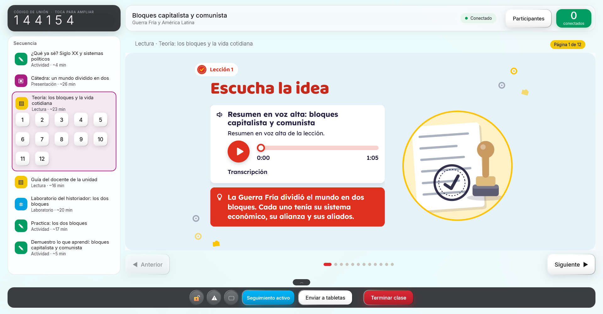
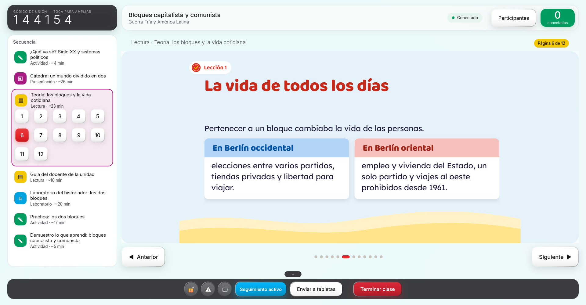
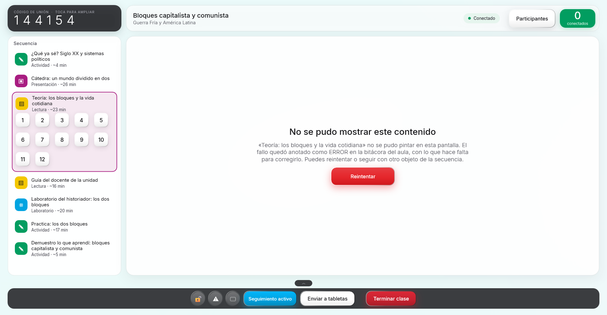
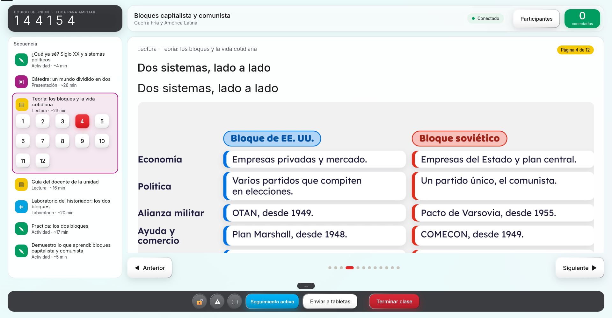
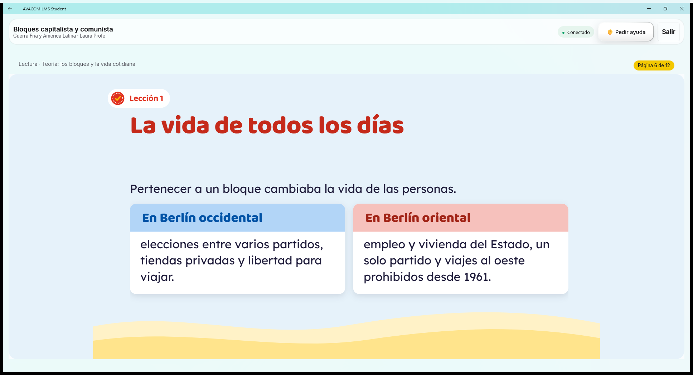
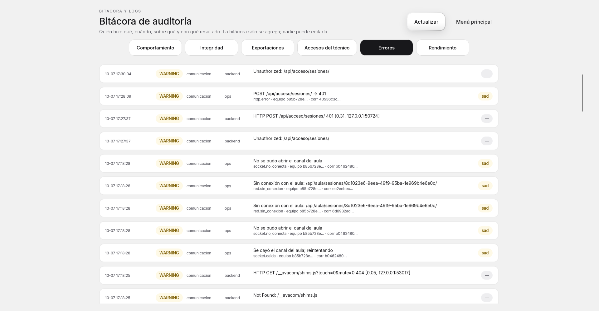

# Bugfix 02 · Al pasar de la Cátedra a la Teoría, OPS y Student se cierran y la bitácora no dice nada

| Campo | Valor |
|---|---|
| Fecha | 2026-10-07 (hallazgo y arreglo) |
| Escenario | Clase en vivo (MOD-007) · proyectar la cátedra lámina por lámina y pasar a la teoría de la misma lección |
| Curso | *Guerra Fría y América Latina* (Ciencias sociales, 11.º, `avacom.co.upper_secondary.11.social-studies.guerra-fria-america-latina` 1.17.4), lección `l1-bloques`: «Cátedra: un mundo dividido en dos» (`l1-catedra`, 19 láminas) → «Teoría: los bloques y la vida cotidiana» (`l1-explicacion`, 12 páginas) |
| Contenido | AVACOM Contenido 2.2.0 (esquema 1.1, contrato 2), la instalada en este equipo con el curso actualizado |
| Síntoma | Las 19 láminas de la cátedra se ven bien; al proyectar la teoría **la aplicación se cierra** (OPS; Student comparte el visor). La Bitácora de auditoría no muestra ningún error ni la causa |
| Estado | **Corregido** en el visor y en el registro de errores. Verificado en vivo con OPS y Student Windows contra el curso real, y en el emulador de Android (ver §8). **No** verificado en una tableta Android real |

## 1. Resumen

Hay **dos defectos**, y el segundo es el que hizo invisible al primero.

1. **El visor del aula montaba el encabezado de la página HTML del curso en dos contenedores a la vez.** Desde el contrato 2 (2026-10-07) la cátedra y la teoría vienen maquetadas por el curso (`html {mediaId, entry}`) y el visor las muestra en una `WebView` dentro de un contenedor propio. El encabezado («Presentación · Cátedra… / Lámina 7 de 19») era **un único objeto reutilizado** para todos los contenedores. Mientras se navegaba dentro de la misma página no se creaba contenedor nuevo y todo iba bien; al pasar a **otra** página (la teoría) se creaba un contenedor nuevo y se le añadía el mismo encabezado, que seguía colgando del anterior. WinUI no admite un elemento con dos padres: lanzó `COMException 0x800F1000` y, como nada la atrapaba, **cerró la aplicación**.
2. **El error no llegó a la bitácora.** Sí quedó en el archivo local del equipo, pero (a) con un texto que no dice nada («WinUI.UnhandledException»), y (b) la cola de entrega al nodo estaba **sólo en memoria** y se subía cada 60 s: la aplicación murió antes de entregarla y el nodo nunca la vio. Además la pestaña «Errores» mostraba las últimas 80 líneas de **todos** los niveles, casi todas peticiones normales (INFO, ruta «happy»), de modo que un error se perdía entre ellas en pocos segundos.

**Arreglo:** cada página HTML trae su propio encabezado; un fallo del visor se atrapa, se anota como ERROR con causa y lugar y la clase sigue; y todo error —incluida una caída— llega a la bitácora del nodo en segundos, legible, y se ve como ERROR.

Al verificar en Android apareció un **tercer hallazgo, sólo de esa plataforma**: la lámina HTML se veía recortada porque la WebView se alejaba (zoom-out) y la página escalaba con una ventana más grande que su recuadro (§8). Se arregló también aquí, porque pedía «que funcione perfecto en Student Android».

## 2. Cómo se reprodujo (antes de tocar nada)

Nodo **aislado** (127.0.0.1:8010, base y logs temporales, instalado con `acceso_instalar`, sin sesión obligatoria) contra la **AVACOM Contenido real** (2.2.0) y la **OPS real** compilada aparte (`C:\temp\ops-bug`, perfil de pruebas `AVACOM_OPS_PERFIL`, `AVACOM_OPS_SERVIDOR` y `AVACOM_OPS_RUTA=clase-sesion?sesion=<id>` para caer directo en la clase). La clase la abre por API la persona profesora de prueba; la proyección se cambia por `POST /api/aula/sesiones/<id>/selector/` o tocando la secuencia, que es el mismo camino del visor.

| # | Prueba | Resultado |
|---|---|---|
| 1 | `GET …/lecciones/l1-bloques/` y `POST …/selector/` de la lámina 19 de la cátedra a la teoría, directamente contra el nodo | **200 y 201**: el nodo entrega la teoría con su `html` (`ausente: false`) y registra el selector. El fallo no es del nodo |
| 2 | OPS real: cátedra, lámina 1 y lámina 6 (con video y pausas para pensar) | Se ven bien |
| 3 | OPS real: proyectar la teoría tras la cátedra | **OPS se cierra.** Windows lo registra como `APPCRASH` en `Microsoft.UI.Xaml.dll`, código `0xc000027b` |
| 4 | `fallos-ops.log` de esa corrida | `COMException (0x800F1000)` con la pila `AulaContenidoView.MostrarHtml (línea 255) ← MostrarUnidades ← Mostrar ← ClaseSesionPage.PintarSelector ← ProyectarAsync ← Ds.Tocable`; el último punto es `_cuerpo.Content = raiz`, al montar el contenedor nuevo |
| 5 | Qué había en la bitácora del nodo | `ops-errores.log` local: **un** renglón ERROR con el mensaje «WinUI.UnhandledException». `backend-clientes.log` del nodo: **nada** |

Por qué cuadra con lo que se ve: el curso tiene tres objetos con página HTML en la misma lección (cátedra, teoría y guía del docente). La **primera** página que se abre no falla (el encabezado no tiene padre todavía) y se puede recorrer entera cambiando de lámina; el fallo aparece en la **segunda** página distinta. Por la lectura del código también ocurría al volver a una página HTML después de abrir otro objeto (el contenedor anterior conserva su encabezado); esto último **no** se probó antes del arreglo.

## 3. Por qué la bitácora no lo vio

| Eslabón | Qué pasaba |
|---|---|
| Mensaje del renglón | `RegistroDeFallos.Escribir` ponía como mensaje el **origen técnico** («WinUI.UnhandledException») y dejaba lo que sirve (tipo, código, lugar) en la traza |
| Cola de entrega | `RegistroLocal` guardaba los WARNING+ pendientes **en memoria**; `EntregadorDeLogs` los subía cada 60 s (la primera vez a los 15 s). Una caída se llevaba la cola por delante |
| Orden de los hechos | La excepción llegaba a `WinUI.UnhandledException`, se escribía en el archivo y el proceso moría **antes** del siguiente ciclo del entregador |
| Lectura | La pestaña «Errores» pedía las últimas 80 líneas sin filtro de nivel: peticiones normales (INFO, «happy») dominan y empujan un ERROR fuera de la vista |
| Excepciones atrapadas | Un toque en la pantalla corre en un `async void` (`Ds.Tocable`): una excepción de la acción cerraba la app en vez de quedar anotada |

## 4. Solución

### 4.1 El visor (`AulaContenidoView`)

* El encabezado de la página HTML **nace con su contenedor** (`_htmlCabecera` es ahora un campo anulable que se crea con cada `Grid` nuevo). Misma página, otra lámina: sólo cambia su texto y el `location.hash`, sin recargar (igual que antes). Otra página: contenedor, encabezado y `WebView` nuevos, y la `WebView` anterior se apaga y sale de la lista. Nada del contenedor viejo se reutiliza.
* **`Mostrar` nunca lanza.** Si montar la pantalla falla: se anota un ERROR `aula.visor.fallo` y el panel muestra una tarjeta «No se pudo mostrar este contenido» con **Reintentar** (la clase sigue, se puede pasar a otro objeto).
* **Respaldo:** si lo que falla es sólo la página HTML, el visor vuelve a los **bloques del curso** (que son la verdad del contenido) y la clase sigue con el texto nativo; el ERROR queda anotado igual.

### 4.2 Los toques (`Ds.Tocable`)

La acción de un toque va dentro de `try/catch`: un fallo se anota como ERROR `ui.toque.fallo` («Falló la acción de un toque en la pantalla (control …); la aplicación sigue abierta») en vez de cerrar OPS o Student. Es el camino que usan los toques de OPS (secuencia, láminas) y de Student.

### 4.3 El registro de errores (Core, compartido por OPS y Student, Windows y Android)

| Cambio | Detalle |
|---|---|
| **Título legible** | `RegistroDeFallos.Escribir` dice qué pasó en palabras, el tipo y el código de Windows (HRESULT) y **dónde** (clase, método y línea de AVACOM, la primera de la pila): «Falló la interfaz de Windows y la aplicación se cerró sin controlarlo. COMException (0x800F1000): … · en AulaContenidoView.MostrarObjeto (AulaContenidoView.cs:167)». El detalle trae `origen`, `tipo`, `codigo`, `donde` y `fatal`. `RegistroDeFallos.Anotar` es lo mismo para un fallo que la app atrapa pero que es un defecto |
| **Cola en disco** | `{app}-pendientes.log` (JSON Lines): cada WARNING+ se anexa al escribirse; se reescribe sólo cuando el nodo **confirma** la entrega (`RegistroLocal.Confirmar`); se recorta a 500; `Configurar` la **recupera** al arrancar. Un cierre, o una clase sin red, ya no pierden lo pendiente |
| **Un ERROR no espera al minuto** | `EntregadorDeLogs` se engancha a `RegistroLocal.Escrito` y entrega 1,5 s después de un ERROR o CRITICAL (un WARNING sigue el ciclo normal). Una entrega programada se cancela si el entregador se detiene |
| **Una caída entrega antes de morir** | `WinUI.UnhandledException` sin `Handled` y `AppDomain.UnhandledException` con `IsTerminating` llaman a `RegistroDeFallos.EntregaUrgente` y esperan **hasta 3 s** a que el error salga. Si el nodo no contesta, no retrasa la caída más que eso y el error queda en el archivo de pendientes para el siguiente arranque |
| **La pestaña «Errores» abre en WARNING o peor** | El filtro de nivel es un mínimo; para ver todo se elige INFO o DEBUG. Tocar una fila muestra además el mensaje completo |

## 5. Cambios realizados

| Archivo | Cambio |
|---|---|
| `src/Avacom.Lms.Ui/Controls/AulaContenidoView.cs` | Encabezado por contenedor (`_htmlCabecera` anulable, nuevo en cada `Grid`), `Mostrar` con guarda y tarjeta «Reintentar», respaldo a bloques si falla la página HTML, `AnotarFalloDelVisor` y `TarjetaDeFalloDelVisor`, la `WebView` anterior se apaga al cambiar de página |
| `src/Avacom.Lms.Ui/Design/Ds.cs` | `Tocable` anota el fallo de la acción y sigue |
| `src/Avacom.Lms.Ui/Design/WebViewAjustes.cs` | `FijarEscala` (sólo Android): sin ventana ancha, sin vista general, sin zoom y escala inicial 100 para la WebView del html del curso; `AulaContenidoView` la llama al crear esa WebView |
| `src/Avacom.Lms.Core/Services/RegistroDeFallos.cs` | Título legible (`Explicacion`, `Resumen`, `CodigoDe`, `DondeFallo`), `Anotar`, `EntregaUrgente` / `EsperaUrgente`, `fatal` |
| `src/Avacom.Lms.Core/Services/RegistroLocal.cs` | `RutaPendientes`, cola en disco, `Confirmar`, `RecuperarPendientes` |
| `src/Avacom.Lms.Core/Services/EntregadorDeLogs.cs` | Entrega 1,5 s tras un ERROR, `Confirmar` tras la entrega, engancha y suelta `EntregaUrgente` |
| `src/Avacom.Lms.Ops/Platforms/Windows/App.xaml.cs`, `src/Avacom.Lms.Student/Platforms/Windows/App.xaml.cs` | `WinUI.UnhandledException` pasa `fatal: !e.Handled` |
| `src/Avacom.Lms.Ops/Pages/BitacoraPage.Errores.cs` | «Errores» abre en WARNING o peor; el detalle de una fila muestra el mensaje completo |
| `tests/Avacom.Lms.Core.Tests/AuditoriaTests.cs` | 10 pruebas nuevas y una ajustada (ver §7) |
| `installer/version.json` | 2.4.1 |
| `spec-driven/05-audit-logs/frontend.md` | Decisiones D-9 a D-11 |
| `spec-driven/qa/bugfix/bugfix-02-catedra-a-teoria.md` | Esta página |

El nodo (backend) **no cambió**: ya recibía y listaba los logs de los equipos; faltaba que llegaran.

## 6. Alternativas descartadas

| Alternativa | Por qué no |
|---|---|
| Marcar `e.Handled = true` en toda excepción de WinUI para que nada cierre la app | Dejaría la pantalla a medias sin que nadie lo vea. Se atrapan los puntos que sí se conocen (visor, toques) con aviso en pantalla y ERROR; lo demás sigue siendo una caída, pero ahora se registra y se entrega |
| Entregar cada renglón de forma síncrona | Bloquearía la clase si el nodo tarda; la entrega urgente sólo se usa cuando el proceso ya va a morir y tiene un tope de 3 s |
| Reutilizar el encabezado quitándolo del padre anterior antes de añadirlo | Frágil: depende de que nadie más lo toque y de que el padre viejo esté todavía vivo. Un encabezado por contenedor no tiene estado compartido |
| Mostrar ERROR en la bitácora sólo cambiando la etiqueta («happy» → «bad») | El renglón de un error ya salía «bad»; el problema era que **no llegaba** y no se leía |

## 7. Pruebas

**Automáticas** (Core 650, eran 640 antes de este arreglo, tres corridas seguidas en verde; Ops 43; Student 81. El visor y los toques no tienen pruebas de unidad —dependen de WinUI y Android—: se verificaron en vivo, ver abajo):

| Qué se prueba | Resultado |
|---|---|
| Una caída se escribe con la frase, el tipo, el código (`0x800F1000`), el lugar y `fatal` | ✔ |
| Sólo una caída intenta la entrega urgente; y ésta no retrasa la caída más de lo concedido (nodo que no contesta) | ✔ |
| Un fallo atrapado deja ERROR con su evento y mensaje, y escribe el archivo plano | ✔ |
| `DondeFallo` dice la clase y el método de AVACOM | ✔ |
| Los pendientes sobreviven a un cierre y se recuperan al arrancar, en orden | ✔ |
| Lo tomado sigue en disco hasta que el nodo confirma | ✔ |
| La cola en disco no crece sin límite | ✔ |
| Un ERROR llega al nodo sin esperar al minuto y un WARNING no; se entrega con lo que esperaba y queda confirmado | ✔ |
| Una caída lleva el error al nodo antes de morir | ✔ |

La prueba del entregador descubrió además un defecto real del arreglo (una entrega programada seguía viva tras detener el entregador y se llevaba la cola del siguiente), corregido.

**En vivo** (nodo aislado 8010, AVACOM Contenido 2.2.0 real, curso real; OPS compilada aparte, ganchos temporales ya retirados):

| Paso | Resultado |
|---|---|
| OPS: cátedra 1 → 6 → 19 → **Teoría** | **Se ve** (Lectura · Teoría, «Página 1 de 12», con su audio y maqueta) |
| OPS: ida y vuelta Teoría p.5 → Guía del docente → Cátedra l.10 → Práctica (actividad) → Teoría p.6 → Cátedra l.1 → Teoría p.12 | **Siete cambios entre páginas HTML y una actividad, sin cierre**; el log local no registró nada |
| OPS: ~17 toques seguidos sobre las láminas, hechos a mano por quien estaba mirando la ventana de prueba | Sin cierre (aparecen en la auditoría como ráfaga de `aula.selector.declarado`) |
| Student Windows siguiendo la clase (entra con el código): cátedra → lámina 19 → Teoría → página 6 → cátedra | Cada cambio se sigue solo; Teoría «Página 1 de 12», «Página 6 de 12» |
| **Fallo provocado** en el visor de la Teoría (gancho temporal): la clase sigue, tarjeta «No se pudo mostrar este contenido», ERROR `aula.visor.fallo` con el objeto, la página 1 de 12, `COMException 0x800F1000` y `AulaContenidoView.MostrarObjeto` | **Llegó al nodo 1,5 s después** (16:22:10,6 en el cliente, 16:22:12,2 en `backend-clientes.log`) |
| **Fallo provocado** sólo en la página HTML (gancho temporal) | La clase sigue con el **texto nativo del curso** («Página 4 de 12») y el ERROR queda anotado |
| **Caída real** del proceso por la misma ruta del fallo original (`WinUI.UnhandledException`) | El ERROR «Falló la interfaz de Windows y la aplicación se cerró sin controlarlo. COMException (0x800F1000)… · en AulaContenidoView.MostrarObjeto (AulaContenidoView.cs:167)» **llegó al nodo 24 ms después de escribirse, antes de que el proceso muriera** |

| **Cola persistente en vivo:** nodo apagado, OPS acumula avisos «sin conexión», se la mata a la fuerza, se enciende el nodo y se reabre OPS | `ops-pendientes.log` existía en disco con los avisos; tras reabrir, el archivo desapareció (entregado y confirmado) y el nodo recibió a las 17:18:28 los avisos que el cliente había escrito entre las 17:17:01 y las 17:17:43 |

## 8. Android (Student) — verificado en emulador

Emulador propio (`bugfix-tab`: tableta de 2560 × 1600, Android 37 beta, x86_64, con el APK x64 de la misma compilación y la misma llave de depuración; el AVD `Pixel_10` del usuario no se tocó), conectado por `http://10.0.2.2:8010` al mismo nodo aislado y al mismo curso real. Se entra a la clase con el código por el teclado propio.

| Paso | Resultado |
|---|---|
| Student Android sigue la cátedra: lámina 1 → 6 (video con póster, controles y pausas para pensar) → 19 → **Teoría** → página 6 → vuelta a la cátedra | **Cada cambio se sigue solo**, la app sigue viva (proceso estable), la teoría aparece con «Página 1 de 12» y su audio |
| La misma cadena de errores llega desde Android: los avisos de la tableta (`socket.caida`, `red.sin_conexion`) aparecen en `backend-clientes.log` del nodo | ✔ |

**Hallazgo aparte, sólo de Android: la lámina se veía recortada.** Con la cátedra y la teoría en html, la lámina aparecía ampliada y cortada por abajo y por la derecha (en Windows no). Se midió dentro de la tableta con una sonda de JavaScript en una **copia aparte** del código (el repo no se tocó):

| Medida | Antes del arreglo | Con el arreglo |
|---|---|---|
| `window.innerWidth × innerHeight` (lo que usa el guion del curso para escalar su escenario de 1920 × 1080) | **1669 × 674** | 2496 × 1007 |
| `clientWidth × clientHeight` y `visualViewport` (el recuadro real) | 1248 × 503 | 2496 × 1007 |
| Escala que calculaba el curso | 0,624 sobre 1669 × 674 → la lámina se desbordaba del recuadro real | 0,932 sobre 2496 × 1007 → entra completa y centrada |

La WebView de Android se «alejaba» (zoom-out) para encajar el contenido y `innerWidth/innerHeight` dejaban de coincidir con el recuadro. **Arreglo:** `WebViewAjustes.FijarEscala` (sólo Android, sólo para la WebView del html del curso): sin ventana ancha, sin vista general, sin zoom y escala inicial 100. Con él, la lámina y la teoría entran completas, y con el video de la cátedra (controles y pausas) también. Girar la tableta antes del arreglo no lo corregía (la página recalculaba con el mismo valor inflado).

## 9. Lo que no se pudo verificar, riesgos y pendientes

1. **No se probó en una tableta Android real**, sólo en el emulador x86_64 (el APK de las tabletas es arm64). El emulador tarda más y muestra a veces «System UI isn't responding» bajo carga: no es de la app.
2. **El ajuste de escala de Android sólo se aplica al html del curso.** Los laboratorios (simulaciones HTML5), los reproductores propios (video/audio/pdf) y los demás visores **no** se tocaron ni se miraron en Android en esta sesión; si alguno mostrara el mismo alejamiento, el arreglo es llamar a `FijarEscala` sobre su WebView.
3. **Excepciones no atrapadas siguen cerrando la aplicación.** Se atraparon los dos caminos que causaron este fallo (visor y toques) y toda caída ahora queda registrada y entregada, pero no se marca `Handled` en general: queda como decisión del CTO si, ante cualquier excepción de la interfaz, OPS debe seguir abierta con un aviso (riesgo: una pantalla a medias que nadie ve).
4. **Un renglón puede entregarse dos veces** (si el proceso cae entre la respuesta del nodo y la confirmación). Es preferible a perderlo; el nodo no deduplica.
5. **La pestaña «Errores» se vio en vivo con una persona administradora** (OPS real, nodo con sesión obligatoria, PIN maestro por el teclado propio): abre en «WARNING o peor» y el resumen dice «happy 0 · sad 10 · bad 7». **No se abrió el detalle de una fila** (el mensaje completo que añade D-11), y el filtro de nivel no se manejó por UI Automation (es un selector propio): los ERROR del fallo se comprobaron en el archivo `backend-clientes.log` del nodo.
6. **El código del visor html del contrato 2 aún no estaba confirmado en git** cuando se hizo este arreglo (era trabajo de la sesión «Bugfix 01 · contrato 2»): el commit de este bugfix lleva con él `AulaContenidoView`, `AulaModels` y `DiagnosticoDeMedio`, que el arreglo necesita para compilar. El resto de lo pendiente (backend del contrato 2, pase de medios, instaladores) sigue sin confirmar.
7. **Student Android olvida la dirección del aula al reabrirse** (muestra siempre `http://192.168.1.10:8000`, `ConnectionPage` no recarga `student_server`): ya conocido, visto de nuevo en el emulador. No se tocó.
8. **Pregunta para el CTO:** el pase del aula, el recorte y este cierre salieron todos de la misma fuente, el visor html del contrato 2, que se puso en marcha sin probarlo contra un curso real de varios objetos html. Conviene que cada nueva capacidad del visor se pruebe con el recorrido completo de una lección (cátedra → teoría → guía → actividad) en OPS, Student Windows y Android antes de entregarla.

## 10. Instaladores 2.4.1

Reconstruidos el 2026-10-07 desde el árbol que contiene este arreglo (`installer/version.json` = 2.4.1, sin cambio de contrato con el backend). Cada compilación terminó con «el código no cambió durante la compilación: el instalador es lo que había al empezar».

| Entrega | Archivo | Tamaño | SHA-256 |
|---|---|---|---|
| OPS (Windows) | `installer/latest/AVACOM-OPS-Master-Setup-2.4.1.exe` | 104,1 MB | `3A96F6E9C22D0EA235282347C479211AD87481910FE6E7B8FBA5341E8F8A0279` |
| Student (Windows) | `installer/student-windows/latest/AVACOM-Student-Setup-2.4.1.exe` | 64,7 MB | `6EF3C9F9C645A3FA798679BB335816E017197A2650A76073E201C053CDD7AA16` |
| Student (Android, arm64) | `installer/student-android/Student LMS 2.4.1.apk` (código de versión 20401, misma llave de depuración) | 20,9 MB | `6BF61F8ED36984A211C3768657DF0864245429E759E592ABC5194D7E4AEC8A89` |
| Servidor LAN del APK | `installer/student-android/Servir-APK.bat` + `Servir-APK.py` + `GUIA-55-TABLETAS.txt` (elige solo el APK más nuevo de la carpeta) | — | — |

**Que llevan las correcciones se comprobó** buscando las cadenas del arreglo dentro de lo que se empaqueta: en `dist/staging/App` (OPS) y en `dist/student-windows/staging/App` (Student) están `FijarEscala`, «No se pudo mostrar este contenido», `ui.toque.fallo`, `-pendientes.log` y «Falló la interfaz de Windows». El APK es sólo arm64 (sin x86_64) y se compiló desde el mismo árbol; su contenido no se puede buscar por cadenas (el almacén de ensambladuras va comprimido), y la prueba en Android se hizo con la compilación x86_64 del mismo código.

**Lo que el instalador de OPS ya garantiza y esta compilación volvió a comprobar** (1145 pruebas del backend en verde, y «el paquete se ensayó de punta a punta: todo correcto»):

* **Permisos** de las carpetas de estado (`%ProgramData%\AVACOM\OPS Master`): control total explícito para el sistema y los administradores en `Config`, `Data`, `Respaldos` y `Logs\auditoria`; `Logs` y el perfil de WebView2 junto a la aplicación quedan además en «modificar» para los usuarios (lectura, escritura y borrado), porque los escribe quien da la clase. Esas carpetas no se borran al desinstalar. El `AVACOM-Verificar-Instalador.bat` hace una prueba real de crear y borrar archivos con la cuenta de quien lo ejecuta.
* **Primer arranque**: el nodo nuevo nace sin organización y con la sesión obligatoria; OPS abre su primer arranque (aula, administrador, PIN maestro de seis dígitos por el teclado propio) y el ensayo comprueba que un PIN fácil o corto se rechaza, que se crean la organización, el administrador y el PIN, que la contraseña inicial la genera el nodo, que un segundo primer arranque se rechaza (409) y que OPS se presenta como equipo MASTER. Además, el nodo escribe sus registros y su auditoría en la carpeta de estado y nunca dentro del programa.
* **El ensayo de actualización con datos** (`-VersionAnterior`) **no se corrió** esta vez; sí se corrió en la entrega 2.4.0.

## 11. Capturas

| Captura | Qué muestra |
|---|---|
|  | OPS: tras la lámina 19 de la cátedra, la **teoría** («Página 1 de 12») con su audio y su maqueta (antes, OPS se cerraba aquí) |
|  | OPS: la teoría en la página 6, después de ir y venir entre cátedra, guía y práctica |
|  | Fallo provocado en el visor: la clase sigue con «No se pudo mostrar este contenido» y «Reintentar»; el ERROR quedó anotado |
|  | Fallo provocado sólo en la página HTML: la clase sigue con el texto nativo del curso |
|  | Student Windows siguiendo la clase: teoría, página 6 de 12 |
|  | La **Bitácora de auditoría**, pestaña «Errores», en OPS con sesión de administrador: abre en «WARNING o peor» (fila con nivel, canal, app, mensaje, evento y ruta happy/sad/bad) |
|  | Android **antes** del ajuste de escala: la lámina se ve ampliada y recortada |
|  | Android **después**: la lámina del video de la cátedra entra completa, con póster, controles y pausas |
